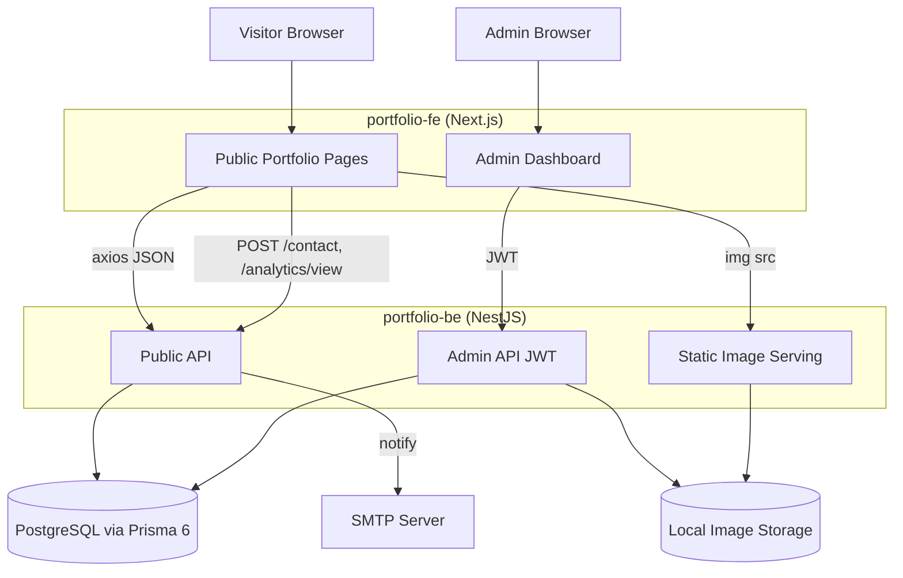
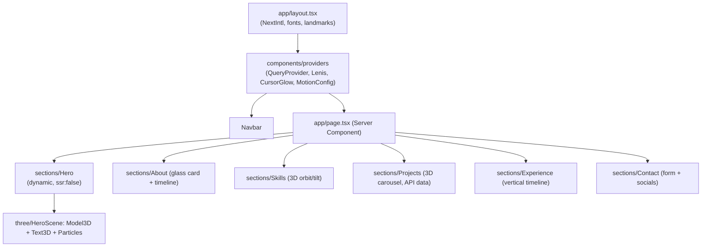

# Design Document: dev-portfolio-3d

## Overview

`dev-portfolio-3d` is a premium developer portfolio built as **two independent projects** that live side by side at the repository root. There is no monorepo tooling, no pnpm workspace, and no shared packages — each project is installed, built, tested, and deployed on its own:

- **`portfolio-fe`** — A Next.js (App Router, TypeScript) frontend rendering the public portfolio and the Admin Dashboard. It layers interactive 3D (React Three Fiber / drei), smooth scrolling (Lenis), scroll-triggered animation (GSAP ScrollTrigger), bilingual i18n (vi/en) via `next-intl`, SEO metadata, and WCAG AA accessibility on top of a dark, glassmorphic visual system.
- **`portfolio-be`** — A NestJS 11 (TypeScript) backend exposing a Public REST API for visitors and a JWT-protected Admin REST API. It persists dynamic content to PostgreSQL via Prisma 6, sends contact notifications over SMTP, rate-limits the contact endpoint, records lightweight page views, serves locally stored images, and publishes interactive Swagger documentation at `/docs`.

Because there are no shared packages, anything that would otherwise be shared — entity types, Zod validation schemas (e.g. `ContactInput`), slug utilities — is **duplicated independently in each project**. The frontend keeps its types in `portfolio-fe/types` and its schemas in `portfolio-fe/lib/schemas`; the backend keeps its own equivalents inside its module/DTO files. The two copies are kept in agreement by convention and by the shared HTTP contract (the REST endpoints), not by a compile-time dependency.

The design follows the phased MVP plan (P1–P6) defined in the requirements. The architecture is intentionally decoupled: the frontend never talks to the database directly, and the backend has no knowledge of rendering concerns. This keeps the 3D-heavy frontend independently deployable (e.g., Vercel) from the API (e.g., Render) and database (e.g., Supabase).

This document describes **how** the system meets all 26 requirements. Where the requirements name concrete examples (Vercel, Render, Supabase, Cloudinary), the design treats them as compatible targets configured purely through environment variables, never hard-coded.

> **Note on Requirement 1 (project structure).** Requirement 1 was written around a pnpm-workspace monorepo with `apps/web`, `apps/api`, `packages/shared`, and `packages/config`. The implemented project deliberately diverges from that literal layout in favor of two standalone projects (`portfolio-fe`, `portfolio-be`) with duplicated contracts and no shared packages. The *intent* of Requirement 1 — a consistent, reproducible structure for developing the frontend and backend together, with a Postgres service for local development — is preserved; the mechanics (workspace, shared packages, root-level docker-compose) are replaced by per-project setup. The `docker-compose.yml` and `.env`/`.env.example` live inside `portfolio-be`.

### Key Design Decisions

| Decision | Rationale |
|---|---|
| Two independent projects, no monorepo | `portfolio-fe` and `portfolio-be` are self-contained at the repo root. Each has its own `package.json`, install, lint, build, and test. Simpler mental model and independent deploys; no workspace orchestration layer (divergence from Req 1's literal monorepo — see note above). |
| Duplicated contracts instead of `packages/shared` | Entity types, Zod schemas (`ContactInput`/`contactSchema`), and slug helpers are copied into each project (`portfolio-fe/types` + `portfolio-fe/lib/schemas`; backend DTOs/files). Agreement is enforced by the REST contract and convention rather than a shared build artifact. |
| Prisma 6 + PostgreSQL | Type-safe schema, first-class migrations, unique constraints map directly to Req 2 slug/key uniqueness. Schema lives in `portfolio-be/prisma/schema.prisma`. |
| `nestjs-zod` on the backend, Zod on the frontend | Each side validates with Zod independently: NestJS DTOs derive from backend Zod schemas via `createZodDto`; React Hook Form validates against `portfolio-fe/lib/schemas`. The two schemas are kept identical by convention. |
| Server Components by default | Frontend pages render on the server; only interactive pieces opt into `"use client"`. SEO-critical content is server-rendered; interactive/3D sections hydrate on the client. |
| axios instance + per-domain services + React Query | A single axios instance (`lib/axios.ts`) is wrapped by per-domain service objects (`services/*.service.ts`) and consumed through React Query hooks (`hooks/queries`, `hooks/mutations`). Client/UI state lives in Zustand stores (`store/`). |
| React Three Fiber + drei | Declarative 3D in React; supports dynamic import with `ssr: false` and responsive tuning (Req 9). |
| GSAP ScrollTrigger + Lenis | Industry-standard smooth scroll + scroll reveal with a clean `prefers-reduced-motion` escape hatch (Req 8, 25). |
| `next-intl` for i18n | App Router-native; supports static UI strings, locale persistence, and browser-language detection via a pure `resolveLocale` (Req 19). |
| JWT (stateless) + bcrypt, single Admin | Matches Req 14's single-account, stateless-auth model; no session store needed. The single Admin is bootstrapped from env by `portfolio-be/prisma/seed.ts`. |
| Local disk image storage behind a storage abstraction | Satisfies Req 16 now; the abstraction allows a later swap to Cloudinary (Req 18.4) without touching controllers. |
| Explicit types everywhere, no `any` | All frontend types are declared explicitly in `portfolio-fe/types` (split per domain); `any` is disallowed. |

### Visual System

- Backgrounds: `#050816` (primary) / `#080A12` (elevated surfaces).
- Primary: cyan/blue gradient family. Accent: violet/pink.
- Glassmorphism: translucent surfaces with backdrop blur and 1px hairline borders.
- Subtle neon glows on interactive elements; a cursor-following radial glow driven by CSS variables.
- Design tokens (colors, fonts, radii) are declared directly in `portfolio-fe/app/globals.css` using Tailwind v4's `@theme` block — there is no shared Tailwind preset.

## Architecture

### System Context



`portfolio-fe` and `portfolio-be` share no code; their only coupling is the HTTP contract. The frontend reaches the backend through a single axios instance whose base URL comes from `NEXT_PUBLIC_API_URL`, and the backend restricts CORS to `WEB_ORIGIN`.

### Request Flow Patterns

**Public content read (Req 3, 4, 10, 11, 20):** Server Components in `portfolio-fe` fetch from the Public API at render time for SEO-critical content. Interactive/3D sections are Client Components that read the same data through React Query hooks (`hooks/queries`), which call per-domain service objects (`services/*.service.ts`) wrapping the shared axios instance (`lib/axios.ts`). On fetch failure the UI renders an error state (Req 10.4).

**Contact submission (Req 12, 13):** The client validates with `contactSchema` (`lib/schemas/contact.schema.ts`) via React Hook Form → a mutation hook (`hooks/mutations/use-contact.ts`) calls `contactService.send` → POST `/contact` → Throttler guard checks IP rate → service persists `Contact_Message` (isRead=false) → SMTP notification fired (failure is logged but does not roll back the saved message) → 201 to client → success toast (sonner).

**Admin mutation (Req 14, 15, 16, 20, 23):** Dashboard attaches `Authorization: Bearer <jwt>` (via the axios instance) → `JwtAuthGuard` validates → controller validates body via an `nestjs-zod` DTO → Prisma write → typed response.

### Project Structure

The repository root contains the two projects as siblings; there is no root `package.json`, no `pnpm-workspace.yaml`, and no `packages/` directory.

```
profile/
├── portfolio-fe/                # Next.js App Router frontend (independent project)
│   ├── app/
│   │   ├── globals.css          # Tailwind v4 @theme design tokens (no shared preset)
│   │   ├── layout.tsx           # root layout: NextIntl, fonts, landmarks, providers
│   │   ├── page.tsx             # one-page portfolio (Hero..Contact)
│   │   ├── projects/[slug]/page.tsx
│   │   ├── blog/page.tsx
│   │   ├── blog/[slug]/page.tsx
│   │   ├── admin/               # Admin Dashboard (login + management)
│   │   ├── sitemap.ts           # Req 24.3
│   │   └── robots.ts            # Req 24.4
│   ├── components/
│   │   ├── sections/            # small per-section components: Hero, About, Skills,
│   │   │                        #   Projects, Experience, Contact
│   │   ├── ui/                  # reusable presentational components
│   │   ├── three/               # R3F scenes: HeroScene, Particles, SkillsCloud, ...
│   │   ├── admin/               # LoginForm, EntityTable, EntityForm, ImageUploader, ...
│   │   └── providers/           # QueryProvider, Lenis/MotionConfig/CursorGlow providers
│   ├── hooks/
│   │   ├── queries/             # React Query read hooks (use-projects, use-skills, ...)
│   │   └── mutations/           # React Query write hooks (use-contact, ...)
│   ├── services/                # per-domain axios service objects (project.service.ts, ...)
│   ├── store/                   # Zustand client/UI state stores (ui.store.ts)
│   ├── lib/
│   │   ├── axios.ts             # single axios instance + error normalization
│   │   ├── query-keys.ts        # centralized React Query keys
│   │   ├── schemas/             # Zod schemas (contact.schema.ts) — duplicated, not shared
│   │   └── i18n/                # next-intl config + pure resolveLocale (Req 19)
│   ├── types/                   # explicit types split by domain (no `any`):
│   │   │                        #   project.ts, skill.ts, experience.ts, blog.ts,
│   │   │                        #   contact.ts, api.ts, index.ts (barrel)
│   ├── messages/                # vi.json, en.json (next-intl catalogs)
│   ├── public/models/           # compressed glTF (Req 9.7)
│   ├── vitest.config.ts         # Vitest + Testing Library + fast-check
│   └── package.json             # own scripts: dev/build/lint/test (vitest run)
│
└── portfolio-be/                # NestJS backend (independent project)
    ├── docker-compose.yml       # local Postgres service (replaces root compose)
    ├── .env / .env.example      # backend env lives here, not at repo root
    ├── prisma/
    │   ├── schema.prisma        # all 8 models (Req 2)
    │   └── seed.ts              # bootstraps the single Admin from env (Req 14.4)
    └── src/
        ├── main.ts              # CORS (WEB_ORIGIN), AllExceptionsFilter, Swagger /docs
        ├── app.module.ts
        ├── prisma/              # PrismaModule (global) + PrismaService
        ├── common/filters/      # AllExceptionsFilter → { statusCode, message, error }
        └── {projects,skills,experiences,blog,contact,
              analytics,upload,auth,admin,settings}/   # feature modules
```

Each project is installed and operated on its own (no single root install). Tests run per project: `portfolio-fe` uses `vitest run`; `portfolio-be` uses `jest` (and `jest --config ./test/jest-e2e.json` for e2e). This satisfies the *intent* of Req 1.7 / 26.4 (a defined command to install and to test each side) without a workspace-wide aggregator.

## Components and Interfaces

### Backend (portfolio-be) Module Map

Each NestJS module owns a controller (HTTP), a service (business logic + Prisma), and DTOs (derived from Zod schemas via `nestjs-zod`). `PrismaService` is provided by a global `PrismaModule`. Public and Admin concerns are separated by route prefix and guards.

| Module | Public routes | Admin routes (JWT) |
|---|---|---|
| `projects` | `GET /projects`, `GET /projects/featured`, `GET /projects/:slug` | `GET/POST /admin/projects`, `PATCH/DELETE /admin/projects/:id` |
| `skills` | `GET /skills` | `GET/POST /admin/skills`, `PATCH/DELETE /admin/skills/:id` |
| `experiences` | `GET /experiences` | `GET/POST /admin/experiences`, `PATCH/DELETE /admin/experiences/:id` |
| `blog` | `GET /posts`, `GET /posts/:slug` | `GET/POST /admin/posts`, `PATCH/DELETE /admin/posts/:id` |
| `contact` | `POST /contact` (throttled) | `GET /admin/contact`, `PATCH /admin/contact/:id/read` |
| `analytics` | `POST /analytics/view` | `GET /admin/analytics` |
| `upload` | — | `POST /admin/upload` (multipart) |
| `auth` | `POST /admin/login` | — |
| `settings` | `GET /settings/:key` (e.g. CV path) | `GET/PUT /admin/settings/:key` |

### Public API Contracts

```
GET /projects            -> 200 Project[]            (ordered by `order` asc)        Req 3.1
GET /projects/featured   -> 200 Project[]            (featured=true, order asc)      Req 3.2
GET /projects/:slug      -> 200 Project | 404                                        Req 3.3, 3.4
GET /skills              -> 200 Skill[]              (order asc)                     Req 4.1
GET /experiences         -> 200 Experience[]         (order asc)                     Req 4.2
GET /posts               -> 200 BlogPost[]           (published=true, publishedAt desc) Req 20.1
GET /posts/:slug         -> 200 BlogPost | 404       (only if published)             Req 20.2, 20.3
POST /contact            -> 201 | 400 | 429                                          Req 12, 13
POST /analytics/view     -> 202 (no PII stored)                                      Req 22
GET /settings/:key       -> 200 { key, value } | 404                                 Req 21.3
```

All responses are JSON (Req 3.5, 4.3). A global exception filter maps domain errors to HTTP codes (404/400/401/429) and a consistent error body `{ statusCode, message, error }`.

### Admin API Contracts

```
POST   /admin/login              { email, password } -> 200 { accessToken } | 401    Req 14.1, 14.2
GET    /admin/projects                                -> 200 Project[]               Req 15.4
POST   /admin/projects           CreateProjectDto     -> 201 Project | 400           Req 15.1, 15.6
PATCH  /admin/projects/:id       UpdateProjectDto     -> 200 Project | 400 | 404     Req 15.2, 15.5, 15.6
DELETE /admin/projects/:id                            -> 204 | 404                   Req 15.3, 15.5
... (skills, experiences, posts mirror the project CRUD shape) ...
GET    /admin/contact                                 -> 200 ContactMessage[]        Req 16.1
PATCH  /admin/contact/:id/read                        -> 200 ContactMessage          Req 16.2
POST   /admin/upload             multipart(file)      -> 201 { url } | 400           Req 16.3, 16.4
GET    /admin/analytics                               -> 200 { total, byPath[], ... }Req 22.4
```

Every `/admin/*` route except `/admin/login` is protected by `JwtAuthGuard` (Req 14.5, 14.6).

### Frontend (portfolio-fe) Component Architecture



The frontend renders **Server Components by default**; only pieces that need interactivity, browser APIs, or hooks declare `"use client"` (e.g. React Query hooks, Zustand consumers, 3D canvases, the contact form). Components under `components/sections` are kept small and focused (one per portfolio section), with shared presentational pieces in `components/ui`, 3D in `components/three`, dashboard pieces in `components/admin`, and context/providers in `components/providers`.

**Data layer (axios → services → React Query):**

- `lib/axios.ts` — a single `apiClient` axios instance; base URL from `NEXT_PUBLIC_API_URL` (Req 18.5), JSON headers, timeout, and `getApiErrorMessage` for normalizing the API error envelope.
- `services/*.service.ts` — per-domain service objects (`projectService`, `skillService`, `experienceService`, `contactService`) that call the axios instance and return typed results. These are the only place that knows endpoint paths.
- `hooks/queries/*` — read hooks (`useProjects`, `useFeaturedProjects`, `useProject`, `useSkills`, `useExperiences`) built on `@tanstack/react-query`, keyed via `lib/query-keys.ts`.
- `hooks/mutations/*` — write hooks (`useSendContact`, admin CRUD mutations).
- `store/*.store.ts` — Zustand stores for client/UI state (`useUiStore`: mobile-nav open state, active section).

**Types (`types/`):** all TypeScript types are declared explicitly and split by domain — `project.ts`, `skill.ts`, `experience.ts`, `blog.ts`, `contact.ts`, `api.ts` — and re-exported from `types/index.ts`. The codebase forbids `any`; service and hook signatures are fully typed.

**Other key frontend modules:**

- `lib/i18n` — `next-intl` config plus a pure `resolveLocale(browserTags)` that always returns a supported locale (`vi`/`en`) and is deterministic (Req 19, Property 3). Locale catalogs live in `messages/{vi,en}.json`.
- SEO — `generateMetadata` helpers and `app/sitemap.ts` / `app/robots.ts` produce per-page title/description/OG/Twitter tags (Req 24).
- Motion/interaction — `useReveal` (ScrollTrigger reveal), `useMagnetic`, `useCursorGlow`, all gated by a reduced-motion check (Req 7, 8, 25.6).
- `components/three` — `HeroScene`, `Particles`, `SkillsCloud`, `ProjectCarousel`; `Particles` reads viewport width to scale particle count (Req 9.6).
- `components/admin` — `LoginForm`, `ProtectedRoute`, `EntityTable`, `EntityForm`, `ImageUploader`, `ContactInbox`.

### Duplicated Contracts (no shared package)

There is no `packages/shared`. The canonical entity types and validation schemas are **duplicated** in each project and kept in agreement by convention and by the REST contract:

- **Frontend types** live in `portfolio-fe/types` (e.g. `Project` in `types/project.ts`), mirroring the Prisma model field-for-field (with date fields as ISO strings).
- **Frontend validation** lives in `portfolio-fe/lib/schemas` (e.g. `contactSchema`), used by React Hook Form.
- **Backend validation** lives in `portfolio-be` alongside its modules; NestJS DTOs derive from backend Zod schemas via `createZodDto` (`nestjs-zod`).
- **Slug utilities** are implemented independently in each project where needed.

Example — the contact contract exists in both places, written identically:

```ts
// portfolio-fe/lib/schemas/contact.schema.ts
export const contactSchema = z.object({
  name: z.string().trim().min(1).max(120),
  email: z.string().trim().email(),
  message: z.string().trim().min(1).max(5000),
});
// portfolio-be: the same shape, wrapped with createZodDto for the POST /contact DTO.
```

Because both sides validate with the same Zod shape, client and server validation stay aligned for Req 12.4, 12.5, 12.8 even though the schema is duplicated rather than shared.

## Data Models

The schema is defined in `portfolio-be/prisma/schema.prisma`. All models use a `cuid` primary key and timestamp columns. Unique constraints enforce the slug/key invariants from Req 2.9–2.11 at the database level.

```prisma
generator client { provider = "prisma-client-js" }
datasource db { provider = "postgresql"; url = env("DATABASE_URL") }

model Project {
  id          String   @id @default(cuid())
  title       String
  slug        String   @unique                 // Req 2.9
  description String
  thumbnail   String?
  images      String[]                          // local URLs
  techStack   String[]
  githubUrl   String?
  demoUrl     String?
  featured    Boolean  @default(false)
  order       Int      @default(0)
  createdAt   DateTime @default(now())
  updatedAt   DateTime @updatedAt
  @@index([featured, order])
}

model Skill {
  id       String @id @default(cuid())
  name     String
  icon     String?
  category String
  level    Int                                  // e.g. 1..5 or 0..100
  order    Int    @default(0)
}

model Experience {
  id          String    @id @default(cuid())
  company     String
  position    String
  description String
  startDate   DateTime
  endDate     DateTime?                          // null => current
  order       Int       @default(0)
}

model BlogPost {
  id          String    @id @default(cuid())
  title       String
  slug        String    @unique                 // Req 2.10
  excerpt     String
  content     String
  coverImage  String?
  tags        String[]
  published   Boolean   @default(false)
  publishedAt DateTime?
  createdAt   DateTime  @default(now())
  updatedAt   DateTime  @updatedAt
  @@index([published, publishedAt])
}

model ContactMessage {
  id        String   @id @default(cuid())
  name      String
  email     String
  message   String
  isRead    Boolean  @default(false)            // Req 12.6, 16.2
  createdAt DateTime @default(now())
}

model SiteSetting {
  key   String @id                              // Req 2.11 (key is PK => unique)
  value String
}

model Admin {
  id           String   @id @default(cuid())
  email        String   @unique
  passwordHash String                            // bcrypt, Req 14.3
  createdAt    DateTime @default(now())
}

model PageView {
  id        String   @id @default(cuid())
  path      String
  referrer  String?
  userAgent String?                              // coarse UA only, no PII (Req 22.3)
  createdAt DateTime @default(now())
  @@index([path, createdAt])
}
```

### Data Model Notes

- **Ordering invariant.** `Project`, `Skill`, `Experience` all carry an `order: Int`; public list endpoints sort ascending by it (Req 3.1, 3.2, 4.1, 4.2). Blog lists sort by `publishedAt desc` (Req 20.1).
- **Slug uniqueness.** Enforced by `@unique`; the service layer generates slugs from titles and resolves collisions before insert (see Property 8).
- **Single Admin (Req 14.4).** Enforced by application logic: the seed/bootstrap creates exactly one `Admin` from env (`ADMIN_EMAIL`, `ADMIN_PASSWORD`), and login only ever authenticates against that account. No public registration endpoint exists.
- **PII avoidance in PageView (Req 22.3).** No IP, cookie, or user identifier is persisted. `userAgent` is stored only as a coarse string (or omitted) and never linked to an identity.
- **Image storage.** Uploaded files are written to a configured local directory and referenced by relative URL served statically; a `StorageService` interface abstracts this so a hosted provider can replace it later (Req 16.3, 18.4).
- **CV path (Req 21.3).** Stored as a `SiteSetting` (`key="cv_url"`) or read from env; never hard-coded.

### Configuration / Environment Variables (Req 18.5, 21.3)

Backend variables live in `portfolio-be/.env` (documented in `portfolio-be/.env.example`); frontend variables live in `portfolio-fe`'s own env. There is no shared root `.env`.

```
# portfolio-be (.env / .env.example)
DATABASE_URL, JWT_SECRET, JWT_EXPIRES_IN,
ADMIN_EMAIL, ADMIN_PASSWORD,
SMTP_HOST, SMTP_PORT, SMTP_USER, SMTP_PASS, CONTACT_NOTIFY_EMAIL,
UPLOAD_DIR, PUBLIC_BASE_URL, WEB_ORIGIN,
CONTACT_RATE_TTL, CONTACT_RATE_LIMIT, PORT
# portfolio-fe
NEXT_PUBLIC_API_URL, NEXT_PUBLIC_SITE_URL, CV_URL (or via /settings)
```

## Correctness Properties

*A property is a characteristic or behavior that should hold true across all valid executions of a system — essentially, a formal statement about what the system should do. Properties serve as the bridge between human-readable specifications and machine-verifiable correctness guarantees.*

The following properties were derived from the acceptance criteria via the testability prework. Pure logic (ordering, validation, slug generation, auth round-trips, locale resolution, viewport-driven tuning, metadata/render content) is suitable for property-based testing; infrastructure, schema shape, styling, and 3D rendering are covered by smoke/example/integration tests instead (see Testing Strategy). Each property below is universally quantified and traces to the requirements it validates.

### Property 1: List endpoints are ordered by `order` ascending

*For any* set of `Project`, `Skill`, or `Experience` records with arbitrary `order` values, the corresponding public list endpoint (`GET /projects`, `GET /skills`, `GET /experiences`) returns all of them in non-decreasing `order` and omits none.

**Validates: Requirements 3.1, 4.1, 4.2, 11.2**

### Property 2: Featured projects are filtered and ordered

*For any* set of projects with arbitrary `featured` flags and `order` values, `GET /projects/featured` returns exactly the subset where `featured = true`, sorted by `order` ascending.

**Validates: Requirements 3.2**

### Property 3: Locale resolution always yields a supported locale

*For any* list of browser language tags (including empty, unknown, or malformed), `resolveLocale` returns a supported locale (`vi` or `en`), returns the configured default when no tag matches, and is deterministic for the same input.

**Validates: Requirements 19.5**

### Property 4: Particle count is reduced on narrow viewports

*For any* viewport width `w < 768`, the computed particle count is strictly less than the count for the wide-screen baseline (`w >= 768`), and the count is always a non-negative integer.

**Validates: Requirements 9.6**

### Property 5: Contact submission validation is sound

*For any* contact input: if it violates the shared schema (invalid email format, or any required field blank/whitespace-only), the API responds 400 and persists no `Contact_Message`, and the client blocks submission; if it satisfies the schema, the API persists exactly one `Contact_Message` with `isRead = false`.

**Validates: Requirements 12.4, 12.5, 12.6, 12.8**

### Property 6: Contact endpoint enforces the rate limit

*For any* configured limit `N` and window, the first `N` POST `/contact` requests from one IP within the window succeed and request `N + 1` returns HTTP 429.

**Validates: Requirements 13.1, 13.2**

### Property 7: Blog list returns only published posts in publishedAt-descending order

*For any* set of blog posts with arbitrary `published` flags and `publishedAt` values, `GET /posts` returns exactly the published subset sorted by `publishedAt` descending.

**Validates: Requirements 20.1**

### Property 8: Generated slugs are unique and well-formed

*For any* sequence of titles (including duplicates and titles differing only by punctuation/case), creating `Project` or `Blog_Post` records produces slugs that are all pairwise unique, match the slug format, and each newly created record is retrievable by its slug.

**Validates: Requirements 2.9, 2.10, 3.3, 20.2**

### Property 9: Admin CRUD round-trips preserve data

*For any* valid entity (`Project`, `Skill`, `Experience`, `Blog_Post`), creating it then reading it back returns equal field values; updating with a valid partial changes exactly those fields and no others; deleting it makes a subsequent read return 404.

**Validates: Requirements 15.1, 15.2, 15.3, 15.4, 20.5**

### Property 10: Operations on non-existent resources return 404

*For any* identifier or slug not present in the database, a public lookup (`GET /projects/:slug`, `GET /posts/:slug` for missing/unpublished) and an admin update or delete return HTTP 404.

**Validates: Requirements 3.4, 15.5, 20.3**

### Property 11: Invalid mutation payloads are rejected with 400

*For any* create/update payload that violates its entity schema, the Admin API returns HTTP 400 and does not modify the database.

**Validates: Requirements 15.6, 20.6**

### Property 12: Password hashing round-trips

*For any* password string, `bcrypt.compare(password, hash(password))` is true, and for any password different from the original, comparison against that hash is false.

**Validates: Requirements 14.3**

### Property 13: Login succeeds iff credentials match the single admin

*For any* email/password pair, `POST /admin/login` returns a JWT when and only when the pair matches the configured single Admin account; otherwise it returns HTTP 401.

**Validates: Requirements 14.1, 14.2, 14.4**

### Property 14: Admin guard authorizes iff a valid token is present

*For any* request to a protected `/admin/*` route, access is granted when and only when a validly-signed, unexpired JWT is presented; a missing, malformed, or expired token yields HTTP 401, and on the client an unauthenticated access to a protected dashboard route redirects to login.

**Validates: Requirements 14.5, 14.6, 23.3**

### Property 15: Marking a message read is a correct, idempotent transition

*For any* `Contact_Message`, marking it read sets `isRead = true`, and marking an already-read message read again leaves it `true` (idempotent) without altering other fields.

**Validates: Requirements 16.2**

### Property 16: Image upload validates by file type

*For any* uploaded file whose MIME type is in the allowed set, `POST /admin/upload` stores it and returns an accessible URL; for any file whose MIME type is not allowed, it returns HTTP 400 and stores nothing.

**Validates: Requirements 16.3, 16.4**

### Property 17: Site settings are keyed and last-write-wins

*For any* sequence of setting writes (including repeated keys), exactly one record exists per key and its value equals the most recent write for that key.

**Validates: Requirements 2.11**

### Property 18: Reduced motion disables non-essential animation

*For any* animation configuration, when `prefers-reduced-motion` is enabled the resolved motion settings disable or minimize non-essential motion; when disabled, the configured motion is preserved.

**Validates: Requirements 8.4, 25.6**

### Property 19: Magnetic button displacement is bounded

*For any* pointer offset within a magnetic element, the resulting translation magnitude never exceeds the configured maximum displacement.

**Validates: Requirements 7.4**

### Property 20: Cursor glow position tracks pointer coordinates

*For any* pointer coordinates within the viewport, the cursor-glow CSS variables are set to those coordinates.

**Validates: Requirements 7.1**

### Property 21: Project card renders all required fields

*For any* `Project` record, the rendered project card output contains its description, each `techStack` entry, an image reference, and GitHub/demo links that open in a new browser tab.

**Validates: Requirements 10.2, 10.5**

### Property 22: Page metadata reflects the record

*For any* `Project` or `Blog_Post` record, the generated page metadata includes a title, description, Open Graph tags, and Twitter Card tags whose values reflect the record's fields.

**Validates: Requirements 24.1, 24.2, 24.5**

### Property 23: Content images always have alt text

*For any* content-bearing image rendered by the Web_App, the element exposes a present, non-empty `alt` attribute.

**Validates: Requirements 25.1**

### Property 24: Body text color pairs meet WCAG AA contrast

*For any* foreground/background token pair designated for body text in the theme, the computed contrast ratio is at least 4.5:1 (or at least 3:1 for large text).

**Validates: Requirements 25.3**

### Property 25: Page-view recording stores no PII and aggregates correctly

*For any* sequence of recorded page views, each stored `Page_View` contains only the allowed fields (no IP, cookie, or personal identifier), the aggregate total equals the number of recorded views, and the sum of per-path counts equals the total.

**Validates: Requirements 22.2, 22.3, 22.4**

### Property 26: Admin token lifecycle round-trips

*For any* successful login, the JWT is persisted by the dashboard and is present for subsequent protected requests; after logout the token is removed and no longer presented.

**Validates: Requirements 23.2, 23.7**

## Error Handling

### Backend (portfolio-be)

A global `AllExceptionsFilter` (`src/common/filters/http-exception.filter.ts`, registered in `main.ts`) produces a consistent JSON error envelope and maps domain conditions to HTTP status codes:

| Condition | Status | Source |
|---|---|---|
| Validation failure (Zod DTO) | 400 | `nestjs-zod` DTO → `BadRequestException` (Req 12.8, 15.6, 16.4, 20.6) |
| Missing/invalid/expired JWT | 401 | `JwtAuthGuard` (Req 14.2, 14.6) |
| Resource not found (slug/id) | 404 | service throws `NotFoundException` (Req 3.4, 15.5, 20.3) |
| Rate limit exceeded | 429 | `ThrottlerGuard` on `/contact` (Req 13.2) |
| Unexpected/server error | 500 | filter catches, logs with correlation id, returns generic body |

Error envelope: `{ "statusCode": number, "message": string | string[], "error": string }`.

**SMTP resilience (Req 12.7).** The contact flow persists the message first, then attempts SMTP send. An SMTP failure is logged and surfaced to monitoring but does **not** fail the request or roll back the saved `Contact_Message` — the visitor still receives a success response (Req 12.9) and the Admin can read the message in the inbox.

**Prisma errors.** Unique-constraint violations (e.g., duplicate slug that slipped past generation) are translated to 409/400 with a clear message; connection errors map to 503.

### Frontend (portfolio-fe)

- **Data fetch failures (Req 10.4):** Sections that load from the Public API render an explicit error state ("Unable to load projects") with a retry affordance, instead of a blank or broken UI. Server Components use `error.tsx` boundaries; client sections use local error state. The axios instance (`lib/axios.ts`) normalizes the backend error envelope via `getApiErrorMessage`.
- **Form validation (Req 12.4, 12.5):** React Hook Form + the Zod resolver (`lib/schemas/contact.schema.ts`) show inline, accessible messages (linked via `aria-describedby`) and block submission until valid.
- **3D failures:** The `HeroScene` is wrapped in an error boundary and a `Suspense` fallback; if WebGL is unavailable or a model fails to load, a static styled fallback renders so the page remains usable (supports Req 25 graceful degradation).
- **Auth expiry (Req 23.3):** A 401 from any admin request clears the stored token and redirects to the login page.

## Testing Strategy

Per Req 26, both projects carry automated tests that run non-interactively in a single (non-watch) run, invoked via each project's own command. The suite combines **example/unit tests** (concrete behaviors, edge cases, integration points), **integration tests** (HTTP + DB through a test database), and **property-based tests** (the universal properties above).

### Property-Based Testing

- **Library:** `fast-check` for both `portfolio-be` (with Jest + supertest) and `portfolio-fe` (with Vitest + Testing Library). Property-based testing is **not** implemented from scratch.
- **Iterations:** each property test runs a minimum of **100** generated cases (`fc.assert(..., { numRuns: 100 })`).
- **Traceability tag:** each property test is annotated with a comment in the format:
  `// Feature: dev-portfolio-3d, Property {number}: {property_text}`
- **Mapping:** each of the 26 correctness properties is implemented by a **single** property-based test.
- **Generators:**
  - Entity generators (random `Project`/`Skill`/`Experience`/`BlogPost` with random `order`, `featured`, `published`, `publishedAt`) for ordering/filter/CRUD properties (1, 2, 7, 9).
  - Title generators (including duplicates, punctuation, mixed case, unicode) for slug uniqueness (Property 8).
  - String/email generators (valid + invalid + whitespace) for contact validation (Property 5).
  - Integer/width generators for particle count and rate-limit properties (Properties 4, 6).
  - Credential/password generators for bcrypt and login properties (Properties 12, 13).
  - Pointer-coordinate and config generators for motion/glow/magnetic properties (Properties 18, 19, 20).
  - Color-token-pair iteration for contrast (Property 24).
  - Page-view sequence generators for analytics (Property 25).
- **DB-backed properties** (1, 2, 5, 7, 8, 9, 10, 11, 15, 16, 17, 25) run against a disposable PostgreSQL test database (the docker-compose service or a transaction rolled back per case) to keep cost bounded while exercising real persistence logic.
- **Frontend properties** (3, 4, 14, 18, 19, 20, 21, 22, 23, 24, 26) run in Vitest + Testing Library / JSDOM against the pure functions and component render output.

### Example / Unit Tests

Used for concrete scenarios and items classified as EXAMPLE in the prework, including: navbar links and section landmarks render (Req 5.1–5.3), responsive nav variants at representative widths (Req 6), card hover-glow enter/leave (Req 7.2, 7.3), scroll reveal trigger wiring (Req 8.1–8.3), contact success/error toasts (Req 12.9, 10.4), CV download link uses configured path (Req 21), admin dashboard CRUD/inbox/upload UIs render (Req 23.1, 23.4–23.6), SMTP send invoked on valid contact (Req 12.7, mock-based).

### Integration Tests

- **API e2e (supertest):** representative happy-path and error-path requests across Public and Admin APIs (Req 26.1), including auth flow, one CRUD cycle per entity, contact + throttle, and upload.
- **Swagger smoke (Req 17):** the documentation path responds with a valid OpenAPI document.
- **Migration smoke (Req 2.12):** `prisma migrate` applies cleanly to the test DB and expected tables exist.

### Accessibility Tests

`axe-core` (via `jest-axe`/`vitest-axe`) runs against key rendered sections to catch keyboard, landmark, and ARIA issues (Req 25.2, 25.4, 25.5). Note: automated checks complement but do not replace manual assistive-technology testing for full WCAG AA assurance.

### Smoke / Configuration Checks

Per-project structure (the two sibling projects `portfolio-fe` and `portfolio-be`), the `portfolio-be/docker-compose.yml` Postgres service, each project's independent install, env-driven configuration, and the presence of a test command in each project (Req 1, 18.5, 26.3, 26.4).

### Commands

Each project is installed and tested independently — there is no workspace-wide aggregator.

```
# frontend (portfolio-fe)
npm install
npm run test            # vitest run (single, non-watch) — Req 26.2, 26.3

# backend (portfolio-be)
npm install
npm run test            # jest (single run) — Req 26.1, 26.3
npm run test:e2e        # jest --config ./test/jest-e2e.json (supertest)
```

## Deployment (Req 18)

| Concern | Approach |
|---|---|
| Frontend hosting | `portfolio-fe` builds as a standard Next.js app, deployable to a frontend platform (e.g., Vercel). `NEXT_PUBLIC_API_URL` / `NEXT_PUBLIC_SITE_URL` from env (Req 18.1, 18.5). |
| Backend hosting | `portfolio-be` builds to `dist/` and starts via `node dist/main`, deployable to a backend host (e.g., Render). All secrets/config from `portfolio-be/.env` (Req 18.2, 18.5). |
| Database | `DATABASE_URL` points to a hosted PostgreSQL (e.g., Supabase); migrations run on deploy (Req 18.3). |
| Image storage | `StorageService` defaults to local disk (`UPLOAD_DIR`); a provider implementation (e.g., Cloudinary) can be enabled by configuration without controller changes (Req 18.4, 16.3). |
| Local dev | `portfolio-be/docker-compose.yml` starts PostgreSQL; `portfolio-be/.env.example` documents all backend variables (Req 1.6). |

CORS on the API is restricted to the configured web origin; the Swagger UI and static image route are exposed under their own paths.

## Requirements Coverage Summary

- **P1 (Req 1–4):** project structure (two sibling projects) + Prisma schema + public read APIs (projects/skills/experiences). Properties 1, 2, 8, 10.
- **P2 (Req 5, 6, 19, 20-display, 21, 24, 25):** layout, responsive, i18n, blog pages, CV, SEO, a11y. Properties 3, 7, 22, 23, 24.
- **P3 (Req 7, 8, 12-form):** cursor/magnetic interactions, smooth scroll/reveal, contact form. Properties 5, 18, 19, 20.
- **P4 (Req 9, 10, 11):** 3D Hero/scenes, projects & experience from API. Properties 4, 21.
- **P5 (Req 12-backend, 13, 14, 15, 16, 17, 20-admin, 22, 23):** contact backend, throttling, auth, CRUD, upload, swagger, analytics, dashboard. Properties 5, 6, 9, 11, 12, 13, 14, 15, 16, 17, 25, 26.
- **P6 (Req 18):** deployment configuration.
- **Cross-cutting (Req 26):** automated testing across both projects.
