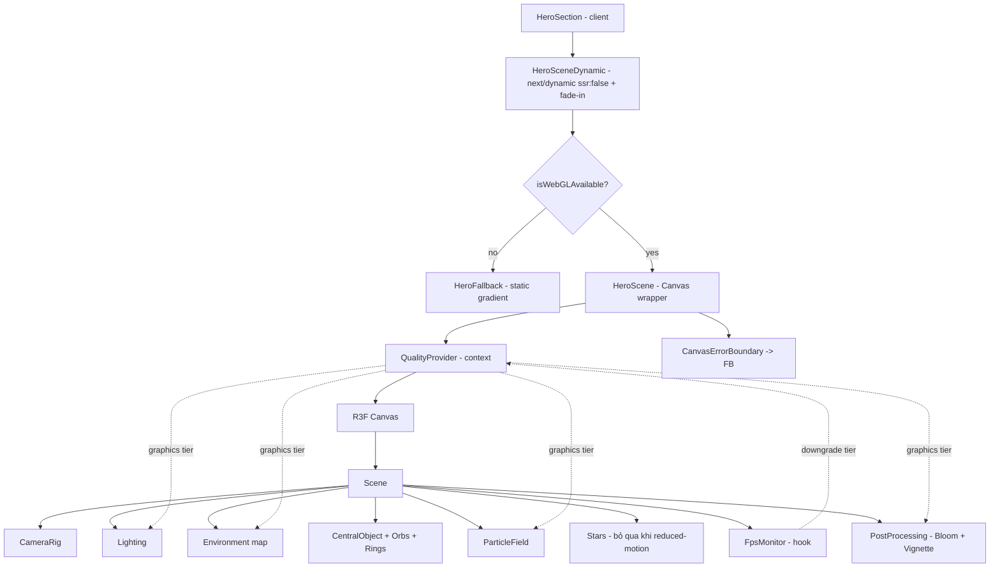

# Design Document

## Overview

Tài liệu này mô tả thiết kế kỹ thuật cho việc nâng cấp chất lượng hình ảnh của cảnh 3D trong khu vực Hero banner (`components/three/HeroScene.tsx`). Mục tiêu là biến cảnh hiện tại — vốn chỉ dùng `meshStandardMaterial`/`MeshDistortMaterial` với ánh sáng point light cơ bản — thành một cảnh có cảm giác cao cấp thông qua: vật liệu PBR phản chiếu môi trường, pipeline hậu kỳ (bloom + vignette), hệ thống ánh sáng key/fill/ambient, bố cục giữ vật thể trung tâm trong khung hình, chuyển động dựa trên delta-time, camera rig parallax mượt, và một hệ thống quản lý chất lượng (Quality_Manager) scale theo thiết bị kèm giám sát FPS thời gian chạy.

Nguyên tắc thiết kế chủ đạo:

1. **Tách logic thuần khỏi render.** Toàn bộ logic có thể kiểm thử (chọn graphics tier, giới hạn DPR, tính trung bình FPS và quyết định hạ tier, giới hạn biên độ camera, tính tỉ lệ vừa khung hình, tính biên độ dao động) được tách ra thành các hàm thuần trong `lib/three/`. Các component R3F chỉ là lớp mỏng tiêu thụ các hàm này. Điều này cho phép kiểm thử dựa trên thuộc tính (property-based testing) mà không cần một WebGL context thực.
2. **Bảo toàn ràng buộc hiện có.** Giữ nguyên `ssr: false`, `aria-hidden`, nền canvas trong suốt, và hành vi `prefers-reduced-motion`. Không thay đổi nội dung văn bản hay layout của `HeroSection`.
3. **Xuống cấp duyên dáng.** Mọi tính năng nặng (bloom, vignette, shadow, environment map độ phân giải cao, mật độ hạt cao) đều có đường lui về tier thấp hơn hoặc về `Fallback_Visual` tĩnh khi WebGL không khả dụng.

### Phụ thuộc mới

Tính năng này yêu cầu thêm **`@react-three/postprocessing`** (chưa được cài) để cung cấp `EffectComposer`, `Bloom`, và `Vignette`. Thư viện này tương thích với `@react-three/fiber` v9 và `three` ^0.184. Phiên bản sẽ được ghim chính xác khi cài đặt (ví dụ `@react-three/postprocessing@^3`, xác nhận tương thích peer với fiber v9 tại thời điểm cài).

### Lưu ý về Next.js 16

Theo `AGENTS.md`, phiên bản Next.js này có breaking changes. Trước khi viết bất kỳ mã đặc thù Next.js nào (đặc biệt là `next/dynamic` với `ssr: false`), người triển khai **PHẢI** đọc hướng dẫn tương ứng trong `node_modules/next/dist/docs/`. Ràng buộc đã biết: trong Next.js App Router hiện đại, `next/dynamic({ ssr: false })` chỉ hợp lệ khi được gọi bên trong một Client Component. `HeroSection` đã có `"use client"`, nên wrapper động trong `components/three/index.tsx` tiếp tục hợp lệ. Không đưa lời gọi `ssr: false` vào Server Component.

## Architecture

### Sơ đồ phân lớp



### Luồng dữ liệu chính

1. **Khởi tạo:** `HeroSceneDynamic` được nạp client-side. Trước khi dựng `<Canvas>`, một guard kiểm tra `isWebGLAvailable()`. Nếu thất bại → render `HeroFallback`.
2. **Chọn tier:** Khi mount, `QualityProvider` thu thập tín hiệu thiết bị (`window.innerWidth/Height`, `devicePixelRatio`, `navigator.hardwareConcurrency`) qua các client guard, rồi gọi `selectInitialTier(signals)` (hàm thuần) để xác định `Graphics_Tier` ban đầu và lưu vào state. Tier này cũng được dùng làm **trần** (không bao giờ nâng cao hơn trong cùng phiên).
3. **Áp dụng preset:** Mỗi tier ánh xạ tới một `TierPreset` (mật độ hạt, DPR tối đa, antialias, bật/tắt shadow, bật/tắt post-processing, độ phân giải environment map). Canvas và các component đọc preset từ context.
4. **Giám sát thời gian chạy:** `useFpsMonitor` tích lũy delta-time mỗi frame, tính FPS trung bình trượt trong cửa sổ thời gian. Khi trung bình dưới ngưỡng liên tục đủ lâu, nó gọi `requestDowngrade()` để hạ tier xuống mức kế tiếp (không reload), giới hạn bởi trần ban đầu.
5. **Reduced motion:** Một hook `usePrefersReducedMotion` theo dõi `matchMedia` và cập nhật phản ứng; ảnh hưởng tới animation, Stars, parallax và dao động tham số hậu kỳ.

### Cấu trúc thư mục đề xuất

```
components/three/
  index.tsx            # wrapper động (cập nhật: thêm fade-in)
  HeroScene.tsx        # Canvas + QualityProvider + error boundary (viết lại)
  HeroFallback.tsx     # mới: nền tĩnh không WebGL
  hero/
    Scene.tsx          # nội dung cảnh
    Lighting.tsx       # key/fill/ambient + shadow theo tier
    PostProcessing.tsx # EffectComposer + Bloom + Vignette
    CameraRig.tsx      # parallax theo pointer/touch
    CentralObject.tsx  # TorusKnot PBR
    Decorations.tsx    # orbs + rings
    ParticleField.tsx  # hạt, mật độ theo tier
lib/three/
  palette.ts           # hằng số bảng màu
  graphicsTier.ts      # type, preset, selectInitialTier, clampDpr, downgradeTier
  fpsMonitor.ts        # logic trung bình FPS + quyết định hạ tier (thuần)
  cameraRig.ts         # computeParallaxTarget, clampOffset, lerp
  composition.ts       # computeFitScale, isWithinFrustum
  animation.ts         # floatOffset, rotationAngle (bounded, delta-based)
  webgl.ts             # isWebGLAvailable
hooks/
  usePrefersReducedMotion.ts
  useFpsMonitor.ts
  useQualityTier.ts
```

## Components and Interfaces

### Quality_Manager (`lib/three/graphicsTier.ts` + `QualityProvider`)

`Quality_Manager` là tổ hợp của: các hàm thuần trong `graphicsTier.ts`, một React context (`QualityProvider`) lưu tier hiện tại và trần ban đầu, và `useFpsMonitor` đẩy yêu cầu hạ tier.

```typescript
export type GraphicsTier = "high" | "medium" | "low";

export interface DeviceSignals {
  screenWidth: number; // px (CSS)
  screenHeight: number; // px (CSS)
  devicePixelRatio: number; // window.devicePixelRatio
  logicalCores: number; // navigator.hardwareConcurrency (mặc định an toàn nếu thiếu)
}

export interface TierPreset {
  tier: GraphicsTier;
  particleCount: number; // số hạt của ParticleField
  maxDpr: number; // trần DPR cho Canvas
  antialias: boolean; // bật khử răng cưa
  shadows: boolean; // bật đổ bóng key light
  postProcessing: boolean; // bật pipeline hậu kỳ
  envMapResolution: "high" | "low" | "color"; // độ phân giải environment map
  starCount: number; // số sao nền (0 khi tier thấp / reduced motion)
}

// Thứ tự giảm dần (cao -> thấp) để hạ tier theo từng bậc.
export const TIER_ORDER: readonly GraphicsTier[] = ["high", "medium", "low"];

export const TIER_PRESETS: Record<GraphicsTier, TierPreset>;

// Ngưỡng tối thiểu để KHÔNG bị ép xuống low (Req 7.2).
export const TIER_THRESHOLDS: {
  minScreenWidth: number;
  maxDpr: number;
  minLogicalCores: number;
};

/** Chọn tier ban đầu từ tín hiệu thiết bị. Thuần, tất định. (Req 7.1, 7.2) */
export function selectInitialTier(signals: DeviceSignals): GraphicsTier;

/** Giới hạn DPR theo trần của tier hiện tại. (Req 7.4) */
export function clampDpr(rawDpr: number, tier: GraphicsTier): number;

/** Trả về tier thấp hơn kế tiếp, hoặc cùng tier nếu đã ở "low". (Req 8.2) */
export function downgradeTier(current: GraphicsTier): GraphicsTier;

/** Lấy preset cho một tier. */
export function getPreset(tier: GraphicsTier): TierPreset;
```

`QualityProvider` interface:

```typescript
interface QualityContextValue {
  tier: GraphicsTier; // tier hiện đang áp dụng
  initialTier: GraphicsTier; // trần — không nâng vượt mức này (Req 8.4)
  preset: TierPreset;
  requestDowngrade: () => void; // FpsMonitor gọi; no-op nếu đã ở "low"
}
```

`requestDowngrade` dùng cập nhật state dạng hàm: `setTier(prev => downgradeTier(prev))`. Vì `downgradeTier` chỉ đi xuống và `selectInitialTier` đặt trần, tier không bao giờ vượt `initialTier` (Req 8.4).

### FPS Monitor (`lib/three/fpsMonitor.ts` + `useFpsMonitor`)

Logic thuần tách khỏi React để kiểm thử:

```typescript
export interface FpsMonitorConfig {
  windowMs: number; // cửa sổ tính trung bình (ví dụ 1000ms)
  minFps: number; // ngưỡng FPS tối thiểu (ví dụ 40)
  sustainedMs: number; // thời lượng liên tục dưới ngưỡng trước khi hạ (ví dụ 2000ms)
}

export interface FpsSample {
  deltaMs: number;
} // delta-time của một frame

export interface FpsMonitorState {
  windowDurationMs: number; // tổng thời lượng các mẫu trong cửa sổ
  windowFrames: number; // số frame trong cửa sổ
  belowThresholdMs: number; // thời lượng liên tục dưới ngưỡng
  shouldDowngrade: boolean; // tín hiệu hạ tier (đặt true đúng một lần khi vượt sustainedMs)
}

export function initFpsState(): FpsMonitorState;

/** Nạp một mẫu delta-time, trả về state mới. Thuần, không side-effect. (Req 8.1, 8.2) */
export function pushSample(
  state: FpsMonitorState,
  sample: FpsSample,
  config: FpsMonitorConfig,
): FpsMonitorState;

/** FPS trung bình hiện tại trong cửa sổ. */
export function averageFps(state: FpsMonitorState): number;
```

`useFpsMonitor(config, onDowngrade)` dùng `useFrame((_, delta) => ...)` để gọi `pushSample`; khi `shouldDowngrade` chuyển sang true, gọi `onDowngrade()` đúng một lần rồi reset bộ đếm `belowThresholdMs`.

### Camera_Rig (`lib/three/cameraRig.ts` + `CameraRig.tsx`)

```typescript
export interface PointerInput {
  x: number;
  y: number;
} // chuẩn hóa [-1, 1]

export interface RigBounds {
  maxOffsetX: number; // biên độ dịch tối đa theo X
  maxOffsetY: number; // biên độ dịch tối đa theo Y
}

/** Mục tiêu camera từ pointer, đã kẹp trong biên. (Req 6.1, 6.2) */
export function computeParallaxTarget(
  pointer: PointerInput,
  bounds: RigBounds,
): { x: number; y: number };

/** Kẹp một offset vào [-max, max]. (Req 6.2) */
export function clampOffset(value: number, max: number): number;

/** Nội suy tuyến tính có hệ số mượt trong [0,1]. (Req 6.1) */
export function lerp(current: number, target: number, alpha: number): number;
```

`CameraRig.tsx`:

- Đăng ký listener `pointermove` và `touchmove` trên phần tử cha của canvas (gộp chuột + chạm, Req 6.4), chuẩn hóa toạ độ về `[-1, 1]` chỉ sau khi mount client (Req 10.2/10.3).
- Mỗi frame: `pos = lerp(pos, computeParallaxTarget(pointer, bounds), alpha)`; cập nhật `camera.position` và `camera.lookAt(0,0,0)`.
- Khi `reducedMotion` bật: không gắn listener và giữ camera tại vị trí gốc (Req 6.3).

### Composition (`lib/three/composition.ts`)

```typescript
export interface ViewportInfo {
  width: number; // px
  height: number; // px
  fovDeg: number; // FOV dọc của camera
  cameraZ: number; // khoảng cách camera tới gốc
}

/**
 * Tính tỉ lệ để vật thể bán kính `objectRadius` vừa trọn khung hình.
 * Trả về <= 1 (chỉ thu nhỏ, không phóng to). (Req 4.3, 4.4, 4.5)
 */
export function computeFitScale(
  objectRadius: number,
  viewport: ViewportInfo,
): number;

/** Nửa chiều cao thế giới nhìn thấy tại mặt phẳng z=0. */
export function visibleHalfHeight(viewport: ViewportInfo): number;

/** Nửa chiều rộng thế giới nhìn thấy tại mặt phẳng z=0. */
export function visibleHalfWidth(viewport: ViewportInfo): number;
```

`CentralObject.tsx` đọc `useThree().viewport`/`size` và `camera`, gọi `computeFitScale` để đặt `scale` của vật thể, cập nhật lại khi viewport đổi (Req 4.4).

### Animation (`lib/three/animation.ts`)

```typescript
export interface FloatConfig {
  amplitude: number; // biên độ dao động vị trí tối đa
  frequency: number; // tần số (rad/s)
  phase: number; // lệch pha cho mỗi vật thể
}

export interface RotationConfig {
  speedX: number; // tốc độ xoay (rad/s)
  speedY: number;
}

/** Độ lệch vị trí trôi theo thời gian tuyệt đối, |kết quả| <= amplitude. (Req 5.1, 5.2) */
export function floatOffset(elapsedSec: number, config: FloatConfig): number;

/** Góc xoay tích lũy = trước + speed*deltaSec (delta-based, độc lập FPS). (Req 5.2) */
export function advanceRotation(
  prevAngle: number,
  deltaSec: number,
  speed: number,
): number;

/** Hệ số giảm biên độ khi reduced motion (0 hoặc rất nhỏ). (Req 5.3) */
export function reducedAmplitude(
  config: FloatConfig,
  reduced: boolean,
): FloatConfig;
```

Các component dùng `useFrame((state, delta) => ...)`: xoay dùng `advanceRotation` với `delta` (delta-based), trôi dùng `floatOffset(state.clock.elapsedTime, ...)`. Khi `reducedMotion`, biên độ được thay bằng `reducedAmplitude`.

### Post_Processing_Pipeline (`hero/PostProcessing.tsx`)

```typescript
interface PostProcessingProps {
  enableBloom: boolean; // độc lập (Req 2.3)
  enableVignette: boolean; // độc lập (Req 2.3)
  reducedMotion: boolean; // tham số tĩnh khi true (Req 2.5)
}
```

- Dựng `<EffectComposer>` từ `@react-three/postprocessing`; thêm `<Bloom>` khi `enableBloom`, `<Vignette>` khi `enableVignette`.
- Component chỉ được render khi `preset.postProcessing === true` (tier `low` tắt toàn bộ — Req 2.4).
- Canvas giữ `alpha: true` và `EffectComposer` không vẽ nền đục, bảo toàn nền trong suốt (Req 2.6).
- Khi `reducedMotion`: dùng tham số bloom/vignette cố định (không animate `intensity` theo thời gian) (Req 2.5).

### Lighting (`hero/Lighting.tsx`)

- `ambientLight` cường độ thấp + một `Environment` (drei) làm ánh sáng môi trường để không có vùng tối tuyệt đối (Req 3.2).
- `directionalLight` (key) màu cyan + `pointLight`/`directionalLight` (fill) màu violet/blue thuộc bảng màu (Req 3.1).
- Khi `preset.shadows`: key light bật `castShadow` (Req 3.4); tier `low` tắt (Req 3.5).
- Mỗi đèn được bọc guard: nếu khởi tạo lỗi (try/catch quanh tạo node hoặc kiểm tra ref), cảnh vẫn render với các đèn còn lại (Req 3.3).

### HeroScene & Fallback (`HeroScene.tsx`, `HeroFallback.tsx`, `index.tsx`)

- `HeroScene` kiểm tra `isWebGLAvailable()` (client guard) trước khi render `<Canvas>`. Bọc `<Canvas>` trong một error boundary; nếu khởi tạo WebGL ném lỗi runtime → log lỗi và chuyển sang `HeroFallback` (Req 12.1, 12.2).
- `HeroFallback`: `<div>` full-bleed, `aria-hidden`, nền gradient dùng đúng bảng màu (cyan/violet/blue/pink), không dùng WebGL (Req 12.3). Không chặn tương tác nội dung Hero (pointer-events-none) (Req 12.4).
- `index.tsx`: wrapper `next/dynamic` `ssr:false` với `loading` là spinner chiếm trọn nền (Req 11.1). Sau khi mount, áp lớp fade-in (transition opacity) trong thời lượng cấu hình (Req 11.2); bỏ qua fade-in khi reduced motion (Req 11.3).

## Data Models

### Bảng màu (`lib/three/palette.ts`)

```typescript
export const PALETTE = {
  cyan: "#22d3ee",
  violet: "#a855f7",
  blue: "#3b82f6",
  pink: "#ec4899",
} as const;

export type PaletteColor = (typeof PALETTE)[keyof typeof PALETTE];
```

### Tier presets (giá trị đề xuất)

| Tier   | particleCount | maxDpr | antialias | shadows | postProcessing | envMapResolution | starCount |
| ------ | ------------- | ------ | --------- | ------- | -------------- | ---------------- | --------- |
| high   | 500           | 2.0    | true      | true    | true           | high             | 800       |
| medium | 300           | 1.5    | true      | false   | true           | 400              |
| low    | 100           | 1.0    | false     | false   | false          | color            | 0         |

### Ngưỡng chọn tier (Req 7.1, 7.2 — giá trị đề xuất)

- `high`: `screenWidth >= 1280` và `devicePixelRatio <= 2` và `logicalCores >= 8`.
- `medium`: `screenWidth >= 768` và `logicalCores >= 4`.
- ngược lại hoặc bất kỳ tín hiệu nào dưới ngưỡng `low` → `low`.
- Khi `navigator.hardwareConcurrency` không xác định, dùng mặc định thận trọng (coi như đủ cho `medium`, không ép `high`).

### FPS monitor config (giá trị đề xuất)

```typescript
const FPS_CONFIG = { windowMs: 1000, minFps: 40, sustainedMs: 2000 };
```

### Camera rig bounds (giá trị đề xuất)

```typescript
const RIG_BOUNDS = { maxOffsetX: 1.2, maxOffsetY: 0.8 };
const RIG_LERP_ALPHA = 0.05;
```

## Correctness Properties

_Một property (thuộc tính) là một đặc tính hoặc hành vi phải luôn đúng trên mọi lần thực thi hợp lệ của hệ thống — về bản chất là một phát biểu hình thức về những gì hệ thống PHẢI làm. Property là cầu nối giữa đặc tả dạng ngôn ngữ tự nhiên và các bảo đảm tính đúng đắn có thể kiểm chứng bằng máy._

Phần này chỉ liệt kê các thuộc tính cho **lớp logic thuần** đã được tách ra `lib/three/` (chọn tier, giới hạn DPR, giám sát FPS, kẹp camera, tính tỉ lệ vừa khung, dao động animation, tổ hợp hậu kỳ, tương phản màu). Các tiêu chí thuần render/UI/SSR (vật liệu, đèn, bố cục cố định, aria-hidden, dynamic import, loading, fallback) được phủ bằng unit/render test và liệt kê trong Testing Strategy.

### Property 1: Chọn tier luôn hợp lệ, tất định và ép `low` khi dưới ngưỡng

_For any_ `DeviceSignals` hợp lệ, `selectInitialTier` luôn trả về một giá trị thuộc `{"high","medium","low"}`, cho cùng kết quả khi gọi lại với cùng đầu vào (tất định), và nếu bất kỳ tín hiệu nào nằm dưới ngưỡng tối thiểu của tier thì kết quả phải là `"low"`.

**Validates: Requirements 7.1, 7.2**

### Property 2: Preset của mỗi tier hợp lệ và đơn điệu theo tier

_For any_ `GraphicsTier`, preset tương ứng thỏa toàn bộ ràng buộc bất biến: tier `low` có `postProcessing === false`, `shadows === false`, `antialias === false`, và `envMapResolution !== "high"`; tier `high` có `shadows === true` và `antialias === true`; đồng thời `particleCount` và `maxDpr` không tăng khi đi từ `high` xuống `medium` xuống `low` (đơn điệu không tăng).

**Validates: Requirements 1.4, 2.4, 3.4, 3.5, 7.3, 7.5, 7.6**

### Property 3: Giới hạn DPR theo trần của tier

_For any_ giá trị `rawDpr > 0` và bất kỳ `GraphicsTier` nào, `clampDpr(rawDpr, tier)` trả về giá trị `> 0`, không vượt quá `maxDpr` của tier đó, và không vượt quá `rawDpr`.

**Validates: Requirements 7.4**

### Property 4: Hạ tier đơn điệu, không bao giờ nâng

_For any_ `GraphicsTier`, `downgradeTier(tier)` trả về một tier có thứ hạng thấp hơn hoặc bằng tier đầu vào (không bao giờ cao hơn), và việc áp dụng `downgradeTier` lặp lại nhiều lần tạo ra một dãy tier đơn điệu không tăng, hội tụ về `"low"`.

**Validates: Requirements 8.4**

### Property 5: Giám sát FPS tính trung bình đúng và chỉ hạ tier khi thấp liên tục đủ lâu

_For any_ chuỗi mẫu delta-time, `averageFps` phản ánh đúng FPS trung bình của các mẫu trong cửa sổ; và `pushSample` chỉ đặt `shouldDowngrade = true` khi FPS liên tục dưới `minFps` trong khoảng thời gian tích lũy đạt `sustainedMs` — ngược lại, nếu mọi mẫu tương ứng FPS ≥ `minFps` thì `shouldDowngrade` luôn là `false`.

**Validates: Requirements 8.1, 8.2**

### Property 6: Mục tiêu camera parallax luôn nằm trong biên

_For any_ `PointerInput` (kể cả toạ độ ngoài khoảng `[-1, 1]`, bất kể nguồn là chuột hay điểm chạm) và bất kỳ `RigBounds` nào, `computeParallaxTarget` trả về `{x, y}` với `|x| <= maxOffsetX` và `|y| <= maxOffsetY`.

**Validates: Requirements 6.2, 6.4**

### Property 7: Nội suy lerp nằm trong khoảng và hội tụ về mục tiêu

_For any_ giá trị `current`, `target` và `alpha` trong khoảng `(0, 1)`, kết quả `lerp(current, target, alpha)` luôn nằm giữa `current` và `target`; và việc áp dụng `lerp` lặp lại với cùng `target` tạo ra dãy tiến gần `target` một cách đơn điệu (khoảng cách tới `target` không tăng).

**Validates: Requirements 6.1**

### Property 8: Tỉ lệ vừa khung giữ vật thể trung tâm trọn trong khung hình

_For any_ `ViewportInfo` hợp lệ và bất kỳ `objectRadius > 0` nào, `computeFitScale` trả về giá trị trong khoảng `(0, 1]` (chỉ thu nhỏ, không phóng to), và bán kính sau khi nhân tỉ lệ (`objectRadius * computeFitScale`) không vượt quá nửa chiều cao lẫn nửa chiều rộng vùng nhìn thấy của khung hình.

**Validates: Requirements 4.3, 4.4, 4.5**

### Property 9: Biên độ dao động trôi bị chặn bởi cấu hình

_For any_ thời điểm `elapsedSec` và bất kỳ `FloatConfig` nào, giá trị tuyệt đối của `floatOffset(elapsedSec, config)` không vượt quá `config.amplitude`.

**Validates: Requirements 5.1**

### Property 10: Chuyển động dựa trên delta-time độc lập với số khung hình

_For any_ tổng thời gian `T` và bất kỳ cách chia `T` thành nhiều bước delta nhỏ, việc tích lũy `advanceRotation` qua các bước nhỏ tạo ra cùng một góc xoay (trong dung sai dấu phẩy động) với việc áp dụng một bước duy nhất có delta bằng `T`.

**Validates: Requirements 5.2**

### Property 11: Chế độ giảm chuyển động làm giảm biên độ trong ngưỡng

_For any_ `FloatConfig`, `reducedAmplitude(config, true)` trả về một cấu hình có `amplitude` nhỏ hơn hoặc bằng cả biên độ gốc lẫn ngưỡng giảm đã định nghĩa, trong khi `reducedAmplitude(config, false)` giữ nguyên biên độ gốc.

**Validates: Requirements 5.3**

### Property 12: Bật/tắt bloom và vignette độc lập nhau

_For any_ tổ hợp hai cờ boolean `(enableBloom, enableVignette)`, tập hiệu ứng được dựng chứa Bloom khi và chỉ khi `enableBloom` là true, và chứa Vignette khi và chỉ khi `enableVignette` là true — trạng thái của cờ này không ảnh hưởng tới sự hiện diện của hiệu ứng kia.

**Validates: Requirements 2.3**

### Property 13: Tham số hậu kỳ tĩnh khi giảm chuyển động

_For any_ hai thời điểm `t1` và `t2`, khi `reducedMotion` là true, hàm tính tham số hậu kỳ (ví dụ cường độ bloom) trả về cùng một giá trị tại `t1` và `t2` (không dao động theo thời gian).

**Validates: Requirements 2.5**

### Property 14: Tương phản văn bản Hero đạt chuẩn WCAG AA

_For any_ cặp token màu (foreground văn bản, background) được sử dụng trong vùng nội dung Hero, tỉ lệ tương phản tính theo công thức WCAG đạt tối thiểu 4.5:1 cho văn bản thường (và 3:1 cho văn bản lớn).

**Validates: Requirements 9.4**

## Error Handling

| Tình huống                                     | Xử lý                                                                                                        | Yêu cầu    |
| ---------------------------------------------- | ------------------------------------------------------------------------------------------------------------ | ---------- |
| WebGL không khả dụng                           | `isWebGLAvailable()` trả `false` trước khi dựng Canvas → render `HeroFallback`                               | 12.1       |
| WebGL context lỗi runtime                      | `CanvasErrorBoundary` bắt lỗi, gọi `console.error` (log), render `HeroFallback`                              | 12.2       |
| Một nguồn sáng khởi tạo lỗi                    | try/catch quanh tạo node đèn; bỏ qua đèn lỗi, render với các đèn còn lại                                     | 3.3        |
| `navigator.hardwareConcurrency` không xác định | Dùng mặc định thận trọng trong `selectInitialTier` (không ép `high`)                                         | 7.1        |
| Truy cập browser API khi chưa mount            | Mọi truy cập `window`/`matchMedia`/`navigator` đặt trong `useEffect` + guard `typeof window !== "undefined"` | 10.2, 10.3 |
| FPS sụt kéo dài                                | `useFpsMonitor` gọi `requestDowngrade()` một lần, hạ tier không reload                                       | 8.2, 8.3   |
| `@react-three/postprocessing` lỗi nạp          | Pipeline hậu kỳ được render có điều kiện; lỗi nằm trong `CanvasErrorBoundary` → fallback                     | 12.2       |

Nguyên tắc: lỗi trong cảnh 3D (mang tính trang trí) **không bao giờ** được phép làm hỏng nội dung văn bản/nút của Hero section (Req 12.4). Mọi đường lui đều dẫn tới `HeroFallback` tĩnh giữ bảng màu chủ đạo.

## Testing Strategy

### Công cụ

- **vitest** (đã cấu hình, môi trường `jsdom`, `globals: true`).
- **fast-check** (đã cài) cho property-based testing.
- **@testing-library/react** + **vitest-axe** cho render test và kiểm tra tiếp cận.

### Property-based tests

Lớp logic thuần trong `lib/three/` là đối tượng chính của PBT vì là hàm thuần, không cần WebGL context, và có không gian đầu vào lớn.

Yêu cầu:

- Mỗi property trong phần Correctness Properties được hiện thực bằng **một** property-based test.
- Mỗi test chạy **tối thiểu 100 vòng lặp** (`{ numRuns: 100 }`).
- Mỗi test gắn comment tham chiếu property theo định dạng:
  `// Feature: hero-3d-visual-enhancement, Property {number}: {property_text}`

Bảng ánh xạ property → module:

| Property | Module / hàm                         | Generator chính                                  |
| -------- | ------------------------------------ | ------------------------------------------------ |
| 1        | `graphicsTier.selectInitialTier`     | `DeviceSignals` (width, height, dpr, cores)      |
| 2        | `graphicsTier.TIER_PRESETS`          | `GraphicsTier` từ `TIER_ORDER`                   |
| 3        | `graphicsTier.clampDpr`              | `rawDpr` dương + tier                            |
| 4        | `graphicsTier.downgradeTier`         | `GraphicsTier`                                   |
| 5        | `fpsMonitor.pushSample/averageFps`   | chuỗi delta-time                                 |
| 6        | `cameraRig.computeParallaxTarget`    | `PointerInput` (gồm giá trị ngoài biên) + bounds |
| 7        | `cameraRig.lerp`                     | current, target, alpha∈(0,1)                     |
| 8        | `composition.computeFitScale`        | `ViewportInfo` + objectRadius                    |
| 9        | `animation.floatOffset`              | elapsedSec + `FloatConfig`                       |
| 10       | `animation.advanceRotation`          | T + phân hoạch ngẫu nhiên thành các bước         |
| 11       | `animation.reducedAmplitude`         | `FloatConfig`                                    |
| 12       | `PostProcessing.buildEnabledEffects` | cặp boolean                                      |
| 13       | tham số hậu kỳ tĩnh                  | t1, t2 + reduced flag                            |
| 14       | `contrast.contrastRatio`             | cặp token màu Hero                               |

### Unit / example tests

Phủ các tiêu chí không phù hợp PBT (render, cấu hình, SSR, UI):

- **Vật liệu & màu (1.1, 1.2, 1.3, 4.2):** xác nhận material là PBR có metalness/roughness; `PALETTE` chứa đúng 4 mã màu; vị trí trang trí trải trên nhiều Z.
- **Hậu kỳ & ánh sáng render (2.1, 2.2, 2.6, 3.1, 3.2):** EffectComposer chứa Bloom/Vignette theo cờ; Canvas `alpha: true`; scene có key+fill+ambient/Environment màu thuộc PALETTE.
- **Chịu lỗi đèn (3.3):** mock buộc một đèn lỗi, scene vẫn render.
- **Stars khi reduced motion (5.4):** reduced → Stars không render.
- **Camera & reduced motion (6.3):** reduced → không gắn listener, camera giữ gốc.
- **Tiếp cận (9.1, 9.2, 9.3):** render test container `aria-hidden="true"`, không focusable; dispatch `matchMedia` change cập nhật state; `vitest-axe` không vi phạm trên `HeroSection`.
- **SSR-safety (10.1, 10.2, 10.3):** wrapper dùng `next/dynamic` `ssr:false`; `isWebGLAvailable()` không ném khi `window` undefined; không truy cập browser API ở top-level module.
- **Loading & fade-in (11.1, 11.2, 11.3):** loading chiếm `inset-0`; sau mount thêm transition opacity; reduced → bỏ fade-in.
- **Fallback (8.3, 12.1, 12.2, 12.3, 12.4):** mock `isWebGLAvailable=false` → render fallback; lỗi trong Canvas → boundary render fallback + `console.error`; fallback dùng PALETTE, `inset-0`, `pointer-events-none`; nút Hero vẫn click được.

### Lưu ý chạy test

Dùng `npm run test` (đã map sang `vitest run`, một lần thực thi) — không dùng chế độ watch trong môi trường tự động. Các property test có thể chậm hơn; giữ generator gọn để 100 vòng lặp hoàn tất nhanh.
