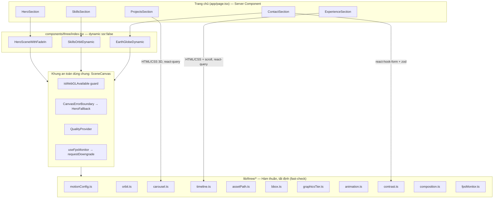
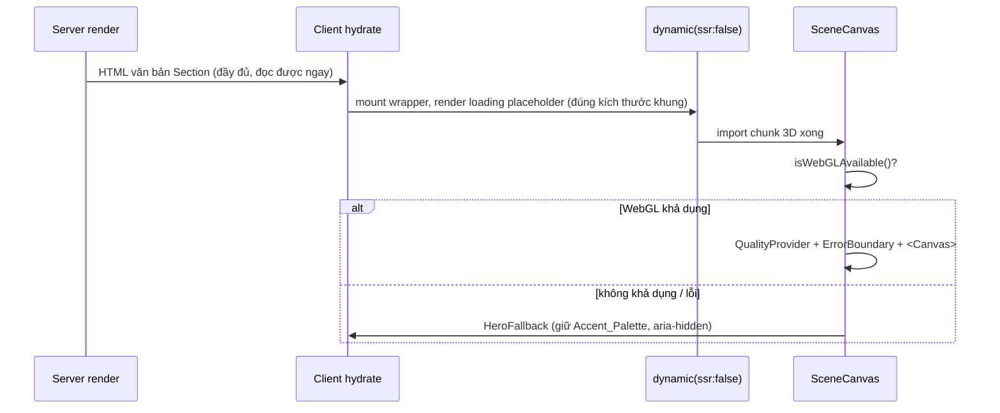
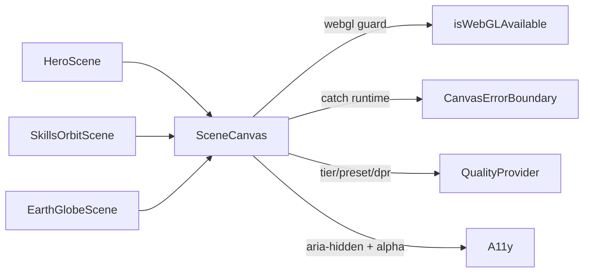
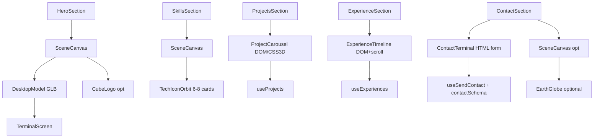
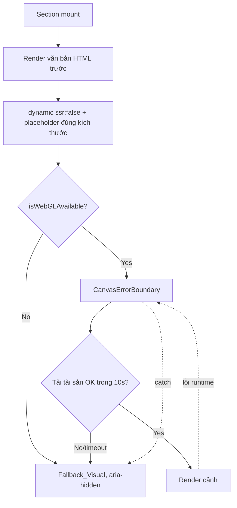

# Design Document — Portfolio 3D Asset Suite

## Overview

Tài liệu này mô tả thiết kế kỹ thuật cho **bộ tài sản 3D dùng chung phong cách**
(Asset_Suite) của `portfolio-fe`. Mục tiêu là sản xuất từng tài sản/hiệu ứng 3D
riêng lẻ — Programmer Desktop, Terminal Screen, Cube Logo, Tech Icon Orbit,
Project Carousel, Experience Timeline, Contact Terminal, Earth Globe (tùy chọn)
— và tích hợp chúng vào đúng Section, **tái sử dụng tối đa** hạ tầng 3D đã được
xây dựng và kiểm thử trong spec `hero-3d-visual-enhancement`.

Nguyên tắc thiết kế xuyên suốt:

1. **Reuse-first**: Không tái phát minh Quality_Manager, FPS monitor, WebGL
   guard, error boundary, fallback, dynamic-import wrapper, lighting hay
   post-processing. Các tài sản mới là "người tiêu dùng" của hạ tầng này.
2. **Pure-logic core, thin R3F shell**: Toàn bộ toán học (quỹ đạo, chỉ số
   carousel, tiến độ timeline scroll, clamp Motion_Config, chuẩn hóa bounding
   box, phân giải đường dẫn tài sản) được tách thành **hàm thuần, tất định**
   trong `lib/three/*`, để kiểm thử bằng property-based testing (fast-check)
   mà không cần WebGL context. Component R3F chỉ là lớp mỏng tiêu thụ chúng
   trong `useFrame`/`useMemo`. Đây chính là pattern đã có ở `lib/three/animation.ts`,
   `composition.ts`, `cameraRig.ts`, `fpsMonitor.ts`.
3. **Shared art direction**: Một `Motion_Config` tập trung và `PALETTE` hiện có
   ràng buộc mọi chuyển động và màu sắc, đảm bảo tính nhất quán "cao cấp, liền
   mạch".
4. **Accessibility & performance by construction**: Mọi cảnh trang trí
   `aria-hidden`, ngoài tab order; văn bản render trước 3D; placeholder giữ CLS = 0;
   DPR và tier tự điều chỉnh theo thiết bị.

### Nguồn hạ tầng tái sử dụng (đã tồn tại và đã kiểm thử)

| Hạ tầng | Module | Vai trò trong Asset_Suite |
| --- | --- | --- |
| Quality_Manager | `components/three/QualityProvider.tsx`, `lib/three/graphicsTier.ts`, `hooks/useQualityTier.ts` | Đọc `tier`/`preset`, `requestDowngrade` cho mọi cảnh |
| FPS monitor | `lib/three/fpsMonitor.ts`, `hooks/useFpsMonitor.ts` | Hạ tier runtime khi FPS sụt (Req 13.4, 13.5) |
| WebGL guard | `lib/three/webgl.ts` (`isWebGLAvailable`) | Guard trước khi mount Canvas (Req 3.4, 3.5) |
| Error boundary + fallback | `CanvasErrorBoundary` trong `HeroScene.tsx`, `HeroFallback.tsx` | Bắt lỗi runtime → Fallback_Visual (Req 3.6, 3.7) |
| Dynamic import wrapper | `components/three/index.tsx` (`ssr: false`) | Nạp mọi cảnh client-only (Req 3.2) |
| Reduced motion | `hooks/usePrefersReducedMotion.ts` | Cập nhật Reduced_Motion_Mode realtime (Req 12.4) |
| Lighting | `components/three/hero/Lighting.tsx` | Dùng lại cho Hero (Req 3.9) |
| Post-processing | `components/three/hero/PostProcessing.tsx`, `lib/three/postProcessing.ts` | Bloom/Vignette cho glow (Req 3.9) |
| Palette | `lib/three/palette.ts` (`PALETTE`) | Accent_Palette cyan/violet (Req 1.2) |
| Contrast | `lib/three/contrast.ts` (`contrastRatio`) | Kiểm tra WCAG AA (Req 9.6, 9.10, 11.2, 12.5) |
| Fit-scale | `lib/three/composition.ts` (`computeFitScale`) | Căn giữa & vừa khung Desktop_Model (Req 4.3, 4.4) |
| Motion primitives | `lib/three/animation.ts` (`floatOffset`, `advanceRotation`, `reducedAmplitude`) | Chuyển động delta-time, FPS-independent (Req 1.6) |
| Data hooks | `hooks/queries/use-projects.ts`, `use-experiences.ts`, `use-skills.ts`, `hooks/mutations/use-contact.ts` | Nguồn dữ liệu cho Carousel/Timeline/Contact |
| Contact schema | `lib/schemas/contact.schema.ts` (`contactSchema`) | Validate form Contact_Terminal (Req 10.5) |

### Phạm vi và các quyết định lớn

- **Hero**: thay `CentralObject` (TorusKnot) bằng `DesktopModel` (GLB) trong
  `components/three/hero/Scene.tsx`. Mọi hạ tầng Hero còn lại giữ nguyên.
- **Skills/Projects/Experience/Contact**: mỗi Section nhận một cảnh 3D độc lập,
  được bọc trong cùng "khung an toàn" như Hero (WebGL guard + error boundary +
  QualityProvider + dynamic import). Để tránh lặp code, ta trích xuất khung này
  thành một component dùng chung `SceneCanvas`.
- **Tài sản mới dựng-bằng-mã** (Cube Logo, Tech Icon Card, Earth) ưu tiên hơn
  tải GLB nặng, đúng tinh thần requirements.

---

## Architecture

### Sơ đồ kiến trúc tổng thể



### Mô hình mount client-only và thứ tự hiển thị

Mọi cảnh WebGL nạp qua `next/dynamic({ ssr: false })` (Req 3.2). Theo Req 13.1,
nội dung văn bản của Section phải render **trước** khi bắt đầu nạp 3D. Vì các
Section đã là Client Component render văn bản trực tiếp (HTML/CSS), còn cảnh 3D
là `dynamic(...)` với `loading` placeholder, nên văn bản luôn xuất hiện trước và
3D nạp sau — không chặn. Placeholder của `loading` chiếm đúng kích thước khung
(Req 13.2) để giữ Cumulative Layout Shift = 0.



### `SceneCanvas` — trích xuất khung an toàn dùng chung

Khung an toàn hiện đang nằm trong `HeroScene.tsx` (WebGL guard qua
`useSyncExternalStore`, `CanvasErrorBoundary`, `QualityProvider`,
`clampDpr`/preset, `alpha:true` + `aria-hidden`). Ta trích xuất thành
`components/three/SceneCanvas.tsx` để Skills Orbit, Earth Globe và Hero cùng
dùng, tránh nhân đôi logic (Req 3.1–3.7). `HeroScene` trở thành một consumer
của `SceneCanvas`.



`SceneCanvas` nhận props: `children` (cây 3D của Section), `fallback` (mặc định
`<HeroFallback/>`), `cameraConfig`, và `fpsConfig` (mặc định `{ windowMs:1000,
minFps:40, sustainedMs:2000 }` — giống `Scene.tsx` hiện tại). Nó đảm bảo mọi
Section đều có cùng hành vi tier/fallback/FPS-downgrade.

### Phân loại tài sản theo công nghệ render

| Tài sản | Kỹ thuật | Lý do |
| --- | --- | --- |
| Desktop_Model | GLB (drei `useGLTF`) trong `<Canvas>` | Mô hình phức tạp, có sẵn nguồn |
| Terminal_Screen | drei `<Text>` + `meshBasicMaterial` trên plane, glow qua Bloom | Nội dung động, nhẹ |
| Cube_Logo | `boxGeometry` + `MeshTransmissionMaterial`/`meshPhysicalMaterial` dựng-bằng-mã | Yêu cầu code-built (Req 6.1) |
| Tech_Icon_Orbit | drei `<Billboard>` + texture SVG trên plane | Billboard có sẵn pattern ở SkillsCloud |
| Project_Carousel | **HTML/CSS 3D** (transform `rotateY`/`translateZ`, `perspective`) | Cần focus bàn phím, link, ảnh — DOM phù hợp hơn WebGL (Req 8.8) |
| Experience_Timeline | **HTML/CSS + scroll** (DOM, IntersectionObserver, Lenis) | Văn bản WCAG AA + parallax cuộn (Req 9.6, 9.10) |
| Contact_Terminal | **HTML form** + react-hook-form + zod | Phải là form HTML truy cập được (Req 10.11, 10.12) |
| Earth_Globe | `sphereGeometry` + texture trong `<Canvas>` | Nền phụ trang trí (Req 11) |

**Quyết định quan trọng:** Project_Carousel, Experience_Timeline và
Contact_Terminal được hiện thực bằng **DOM/CSS 3D** thay vì WebGL. Lý do: cả ba
chứa nội dung tương tác (link, nút, trường form) bắt buộc phải nhận tiêu điểm
bàn phím và có accessible name (Req 8.8, 10.11, 10.12, 12.3). Đặt nội dung tương
tác trong WebGL sẽ phá vỡ khả năng truy cập. CSS `transform-style: preserve-3d`
+ `perspective` đủ để tạo chiều sâu 3D (nghiêng theo con trỏ, băng chuyền, thẻ
trung tâm lớn hơn) mà vẫn giữ DOM ngữ nghĩa. Toán học định vị/chỉ số vẫn là hàm
thuần để PBT.

---

## Components and Interfaces

### 1. Shared: `lib/three/motionConfig.ts` (MỚI)

Định nghĩa Motion_Config tập trung và hàm kẹp giá trị về ngưỡng (Req 1.4, 1.5,
1.7). Là nguồn chân lý cho mọi biên độ/tốc độ/chu kỳ của Asset_Suite.

```ts
export interface MotionConfig {
  /** Biên độ dịch chuyển tối đa (đơn vị thế giới). Trần: 0.5 (Req 1.4). */
  maxTranslation: number;
  /** Tốc độ quay tối đa (vòng/giây). Trần: 0.1 rev/s (Req 1.4). */
  maxRotationRevPerSec: number;
  /** Chu kỳ lặp tối thiểu (giây). Sàn: 4s (Req 1.5). */
  minCyclePeriodSec: number;
}

/** Ngưỡng cứng theo Art_Direction. */
export const MOTION_LIMITS = {
  maxTranslation: 0.5,
  maxRotationRevPerSec: 0.1,
  minCyclePeriodSec: 4,
} as const;

/** Kẹp một MotionConfig về trong các ngưỡng cho phép (Req 1.7). Thuần. */
export function clampMotionConfig(input: MotionConfig): MotionConfig;

/** Kẹp biên độ dịch chuyển về [0, maxTranslation]. Thuần. */
export function clampTranslation(value: number): number;

/** Kẹp tốc độ quay (rev/s) về [0, maxRotationRevPerSec]. Thuần. */
export function clampRotationSpeed(revPerSec: number): number;

/** Ép chu kỳ lặp không nhỏ hơn minCyclePeriodSec. Thuần. */
export function clampCyclePeriod(periodSec: number): number;
```

Orbit_Motion_Config (Req 7.6) là một hằng số chuyên biệt sống trong `orbit.ts`,
được kiểm tra phải nằm trong giới hạn của `MOTION_LIMITS` (6°/s = 1/60 rev/s ≤
0.1; biên độ bay 0.05 ≤ 0.5; chu kỳ 4s ≥ 4s).

### 2. Hero: `components/three/hero/DesktopModel.tsx` (MỚI) thay `CentralObject`

Thay thế TorusKnot trong `Scene.tsx` (Req 3.8). Tải GLB đã tối ưu qua drei
`useGLTF`, áp vật liệu tông tối + emissive Accent_Palette (Req 4.2), căn giữa &
fit-scale bằng `computeFitScale` (Req 4.3, 4.4), giảm chi tiết theo tier `low`
(Req 4.5), giảm chuyển động khi reduced motion (Req 4.6).

```ts
export interface DesktopModelProps {
  reducedMotion: boolean;
  preset: TierPreset;          // từ useQualityTier
  onLoaded?: () => void;       // báo cho Terminal_Screen mount (Req 5.1)
  onError?: (e: unknown) => void;
}
```

Hành vi tải:
- Đường dẫn lấy qua `resolveModelPath("programmer-desktop")` (mục 8) → ưu tiên
  `models/programmer-desktop.optimized.glb`, fallback `programmer_desktop_3d_pc.glb`
  kèm cảnh báo (Req 2.5, 2.8).
- Bọc trong `<Suspense>` với Loading_State chiếm trọn nền Hero (Req 4.7).
- Timeout 10s: nếu chưa xong → `onError` → Hero hiển thị `HeroFallback`
  (Req 4.8). Hiện thực bằng một `useEffect` đặt `setTimeout(10000)` huỷ khi
  `onLoaded` chạy; khi hết giờ ném/đặt cờ lỗi để `CanvasErrorBoundary` hoặc state
  cha chuyển fallback.
- Marker `aria-hidden` đã có ở container `SceneCanvas` (Req 4.10).

Căn giữa: sau khi load, đọc bounding box (`THREE.Box3().setFromObject`), dịch
model về tâm và áp `computeFitScale(boundingRadius, viewport)`. Tính lại khi
`size` đổi với debounce 500ms (Req 4.4) — dùng một `useEffect` + `setTimeout`.

### 3. Hero: `components/three/hero/TerminalScreen.tsx` (MỚI)

Plane đặt trên bề mặt màn hình của Desktop_Model, render sau khi model loaded
trong 1s (Req 5.1). Panel nền đen opacity 0.7–1.0, chữ cyan/xanh lá (Req 5.2),
con trỏ nhấp nháy chu kỳ 0.5–1.0s khi không reduced motion (Req 5.3), glow 4–16px
(qua Bloom + emissive) (Req 5.4). Reduced motion → tĩnh (Req 5.5). Tier `low` →
texture tĩnh `textures/terminal-screen.png`, tắt glow (Req 5.6). `aria-hidden`,
không focus (Req 5.7). Lỗi tải → panel đen đồng nhất, không phá bố cục (Req 5.8).

```ts
export interface TerminalScreenProps {
  reducedMotion: boolean;
  tier: GraphicsTier;
  /** Vị trí/kích thước plane khớp bề mặt màn hình của Desktop_Model. */
  anchor: { position: [number, number, number]; size: [number, number] };
}
```

Logic nhấp nháy con trỏ dùng hàm thuần `cursorVisible(elapsedSec, periodSec)`
trong `lib/three/terminal.ts` (mục dưới) để tất định và testable.

### 4. Shared: `components/three/CubeLogo.tsx` (MỚI)

Khối lập phương dựng-bằng-mã (`boxGeometry`), vật liệu kính/kim loại
(`meshPhysicalMaterial` với `transmission`/`metalness`), gradient cyan→violet
(Req 6.1, 6.2), chữ "T" trên mặt hướng camera qua drei `<Text>` (Req 6.3). Xoay
quanh trục đứng bằng `advanceRotation` (delta-time) với tốc độ ≤ Motion_Config
sao cho 1 vòng ≥ 8s (Req 6.4) → tốc độ = `2π/8` rad/s = 0.125 rev/s? Không —
0.125 > 0.1 rev/s. **8s/vòng = 0.125 rev/s vượt trần 0.1**; do đó chu kỳ tối
thiểu để tuân Motion_Config là 10s/vòng (0.1 rev/s). Req 6.4 nói "tối thiểu 8
giây" (tức ≥ 8s, chậm hơn càng tốt). Ta chọn **10s/vòng** để vừa ≥ 8s vừa ≤ 0.1
rev/s. Glow theo cấu hình (Req 6.5), tắt/giảm ở tier `low` (Req 6.8), dừng khi
reduced motion (Req 6.7). Có thể dùng làm nền Hero, loading indicator, hoặc logo
(Req 6.6) qua prop `role`.

```ts
export interface CubeLogoProps {
  letter?: string;              // mặc định "T"
  reducedMotion: boolean;
  tier: GraphicsTier;
  role?: "hero-bg" | "loading" | "brand";
}
```

### 5. Skills: `components/three/skills/TechIconOrbit.tsx` + `TechIconCard.tsx` (MỚI)

Tích hợp trong Skills Section (Req 7.1). Hiển thị 6–8 thẻ (tier `low` ≤ 6 — Req
7.2, 7.10), mỗi thẻ một SVG từ `public/icons/` (Req 7.12). Bố trí đều trên vòng
tròn (360°/n — Req 7.3), billboard luôn hướng camera lệch ≤ 1° (Req 7.4), xoay
quỹ đạo + bay lên xuống theo Orbit_Motion_Config (Req 7.5, 7.6). Hover hiện tên
kỹ năng + tăng glow trong 200ms (Req 7.7, 7.8). Reduced motion → tĩnh (Req 7.9).
SVG lỗi → icon dự phòng, giữ vị trí (Req 7.11).

Vị trí mỗi thẻ tính bằng hàm thuần `computeOrbitPosition` trong `lib/three/orbit.ts`
(Req 7.13). Component chỉ áp kết quả vào `group.position`.

```ts
export interface TechIconOrbitProps {
  skills: Skill[];              // từ useSkills(); cắt 6–8 theo tier
  reducedMotion: boolean;
  tier: GraphicsTier;
}
export interface TechIconCardProps {
  iconUrl: string;              // public/icons/*.svg
  label: string;                // tên kỹ năng
  basePosition: [number, number, number];
  hovered: boolean;
  reducedMotion: boolean;
}
```

### 6. Projects: `components/sections/ProjectCarousel.tsx` (MỚI, DOM/CSS 3D)

Tích hợp trong Projects Section (Req 8.1). Lấy dữ liệu qua `useProjects()`
(Req 8.2). Thẻ trung tâm lớn 1.1–1.3×, hai bên opacity 0.4–0.6 (Req 8.3). Hover
nghiêng ≤ 15°, glow viền, phóng ảnh ≤ 1.1×, đổ bóng cyan/violet, 100–300ms
(Req 8.4). Điều hướng next/prev 300–600ms (Req 8.5). Link GitHub/Demo là `<a>`
focus được, có nhãn (Req 8.8); ẩn nút khi URL `null` (Req 8.7). Reduced motion →
tắt nghiêng/phóng, chỉ chuyển thẻ ≤ 100ms (Req 8.9). Viewport ≤ 768px → một thẻ
trung tâm, tiêu đề ≥ 16px, vùng chạm ≥ 44×44px (Req 8.10). Lỗi tải → thông báo
lỗi (Req 8.11); rỗng → trạng thái rỗng (Req 8.12); thiếu ảnh → placeholder
(Req 8.13).

Toán chỉ số/biến đổi thẻ là hàm thuần trong `lib/three/carousel.ts` (Req 8.6).

```ts
export interface ProjectCarouselProps {
  projects: Project[];
  reducedMotion: boolean;
}
```

### 7. Experience: `components/sections/ExperienceTimeline.tsx` (MỚI, DOM/CSS + scroll)

Tích hợp trong Experience Section (Req 9.1). Dữ liệu qua `useExperiences()`,
sắp xếp tăng theo `order`, tie-break giảm theo `startDate` (Req 9.2). Đường dọc
kiểu mạch điện + thẻ kính (Req 9.3). Đường sáng tỷ lệ đúng tiến độ cuộn chuẩn
hóa [0,1] (Req 9.4). Thẻ trượt vào khi ≥ 30% trong viewport, 300–600ms, chỉ chẵn
trượt trái / lẻ trượt phải (Req 9.5). Nền lưới dưới thẻ, không phá tương phản
(Req 9.6). Văn bản WCAG AA ≥ 4.5:1 / 3:1 (Req 9.10). Reduced motion → trạng thái
cuối, đường 100% (Req 9.8). `endDate` null → "Present" (Req 9.9). Rỗng → thông
báo, không render đường/thẻ (Req 9.11).

Tiến độ cuộn + thứ tự sắp xếp + hướng trượt là hàm thuần trong `lib/three/timeline.ts`
(Req 9.7). Tích hợp Lenis (đã có `LenisProvider`) cho smooth scroll; tiến độ
tính từ `scrollTop`/`offsetTop`/`height` qua `normalizeScrollProgress`.

```ts
export interface ExperienceTimelineProps {
  experiences: Experience[];
  reducedMotion: boolean;
}
```

### 8. Contact: `components/sections/ContactTerminal.tsx` (MỚI, HTML form)

Tích hợp trong Contact Section (Req 10.1). Prompt kiểu dòng lệnh cho name/email/
message + con trỏ nhấp nháy chu kỳ 1s (Req 10.2). Thẻ kính mờ, monospace
(Req 10.3). Focus glow chỉ trên trường đang focus (Req 10.4). Submit validate
bằng `contactSchema` (đã trim) (Req 10.5); lỗi → chặn gửi, hiện lỗi từng trường,
giữ dữ liệu (Req 10.6); hợp lệ → gọi `useSendContact` (Req 10.7). Pending →
trạng thái xử lý + vô hiệu nút (Req 10.8). Thành công → "Message sent
successfully!" (Req 10.9). Lỗi mutation → thông báo, giữ dữ liệu (Req 10.10).
Mỗi trường là form element focus được, có label (Req 10.11), hoàn tất bằng bàn
phím (Req 10.12). Reduced motion → con trỏ tĩnh, tắt nghiêng (Req 10.13).

Tái sử dụng pattern react-hook-form + zodResolver hiện có trong `ContactSection.tsx`,
chỉ thay lớp trình bày sang phong cách terminal. Con trỏ nhấp nháy dùng
`cursorVisible` thuần (mục `lib/three/terminal.ts`).

### 9. Earth (tùy chọn): `components/three/earth/EarthGlobe.tsx` (MỚI)

`sphereGeometry` + texture `textures/earth.jpg`, xoay 0.5–2°/s (Req 11.1), glow
xanh nhẹ không phá WCAG AA (Req 11.2), nền phụ Contact/Footer ≤ 40% viewport,
`pointer-events: none` (Req 11.3). Reduced motion → tĩnh (Req 11.4). Tier `low`
→ tắt (Req 11.5). `aria-hidden` (Req 11.6). WebGL không khả dụng / texture lỗi →
ẩn, giữ nền tĩnh, không hiện lỗi (Req 11.7). Bật/tắt qua feature flag
`NEXT_PUBLIC_ENABLE_EARTH` hoặc prop.

### 10. Asset pipeline: `scripts/optimize-assets.mjs` (MỚI)

Script Node chạy thủ công/CI để tối ưu GLB (Req 2.1, 2.2, 2.7):

```bash
npx gltf-transform optimize \
  public/models/programmer_desktop_3d_pc.glb \
  public/models/programmer-desktop.optimized.glb
```

Script:
1. Chạy `gltf-transform optimize`; kiểm tra exit code và sự tồn tại file đầu ra.
2. So sánh kích thước: đầu ra ≤ nguồn (Req 2.1). Nếu lớn hơn → cảnh báo.
3. Áp chuẩn hóa bounding box (center→origin, maxDim→1.0) bằng transform tính từ
   `lib/three/bbox.ts` (Req 2.4) — đọc GLB, đo Box3, ghi lại node transform.
4. Nếu lệnh thất bại (exit ≠ 0 hoặc thiếu output) → giữ nguyên nguồn + in lỗi rõ
   ràng (Req 2.7), exit code ≠ 0.

### Sơ đồ tích hợp Section ↔ tài sản



---

## Data Models

### Kiểu dữ liệu hiện có (tái sử dụng nguyên trạng)

```ts
// types/project.ts
interface Project {
  id: string; title: string; slug: string; description: string;
  thumbnail: string | null; images: string[]; techStack: string[];
  githubUrl: string | null; demoUrl: string | null;
  featured: boolean; order: number; createdAt: string; updatedAt: string;
}

// types/experience.ts
interface Experience {
  id: string; company: string; position: string; description: string;
  startDate: string; endDate: string | null; order: number;
}

// types/skill.ts
interface Skill {
  id: string; name: string; icon: string | null;
  category: string; level: number; order: number;
}

// lib/schemas/contact.schema.ts
const contactSchema = z.object({
  name: z.string().trim().min(1).max(120),
  email: z.string().trim().email(),
  message: z.string().trim().min(1).max(5000),
});
```

### Kiểu dữ liệu mới (pure-logic)

```ts
// lib/three/orbit.ts
export interface OrbitParams {
  index: number;        // chỉ số thẻ (0-based)
  total: number;        // tổng số thẻ (6..8)
  radius: number;       // bán kính quỹ đạo (world units)
  elapsedSec: number;   // thời gian trôi qua
}
export interface OrbitTransform {
  position: [number, number, number]; // (x, y, z) trên vòng tròn + bay
  baseAngleDeg: number;                // góc gốc = index * 360/total
}

// lib/three/carousel.ts
export interface CarouselState {
  centerIndex: number;  // chỉ số thẻ trung tâm hiện tại
  total: number;
}
export interface CardPlacement {
  slotOffset: number;   // khoảng cách (số thẻ) tới trung tâm, có dấu
  scale: number;        // 1.0..1.3 (trung tâm lớn nhất)
  opacity: number;      // 0.4..1.0
  translateX: number;   // dịch ngang (px hoặc đơn vị tuỳ tỉ lệ)
}

// lib/three/timeline.ts
export interface ScrollInput {
  scrollTop: number; sectionTop: number; sectionHeight: number; viewportHeight: number;
}
export type SlideDirection = "left" | "right";

// lib/three/bbox.ts
export interface BoundingBox { min: [number,number,number]; max: [number,number,number]; }
export interface NormalizationTransform { translate: [number,number,number]; scale: number; }

// lib/three/assetPath.ts
export interface AssetPaths { optimized: string; source: string; }
```

### Public_Asset_Layout — Cấu trúc thư mục đầu ra (Req 2.3, 2.6)

```
public/
├── models/
│   ├── programmer_desktop_3d_pc.glb        # nguồn (đã có)
│   ├── programmer-desktop.optimized.glb    # ĐẦU RA tối ưu (Req 2.2) — BẮT BUỘC
│   ├── cube-logo.glb                       # tùy chọn (nếu không dựng-bằng-mã)
│   └── earth.glb                           # tùy chọn
├── textures/
│   ├── terminal-screen.png                 # texture tĩnh tier low (Req 5.6)
│   ├── earth.jpg                           # tùy chọn (Earth_Globe)
│   └── noise.png                           # nhiễu cho vật liệu/nền
└── icons/
    └── *.svg                               # biểu tượng công nghệ (Tech_Icon_Card)
```

Bảng tệp đầu ra dự kiến (tài liệu hóa theo Req 2.6):

| Tệp | Bắt buộc | Mục đích | Yêu cầu |
| --- | --- | --- | --- |
| `models/programmer-desktop.optimized.glb` | Có | Desktop_Model trong Hero | 2.2, 2.4, 2.5 |
| `models/cube-logo.glb` | Tùy chọn | Cube_Logo (nếu dùng GLB) | 2.6 |
| `models/earth.glb` | Tùy chọn | Earth_Globe (nếu dùng GLB) | 2.6 |
| `textures/terminal-screen.png` | Có | Terminal_Screen tier `low` | 2.6, 5.6 |
| `textures/earth.jpg` | Tùy chọn | Texture Earth_Globe | 2.6, 11.1 |
| `textures/noise.png` | Có | Nhiễu vật liệu/nền | 2.6 |
| `icons/*.svg` | Có | Tech_Icon_Card | 2.6, 7.12 |

---

## Correctness Properties

*A property is a characteristic or behavior that should hold true across all
valid executions of a system — essentially, a formal statement about what the
system should do. Properties serve as the bridge between human-readable
specifications and machine-verifiable correctness guarantees.*

Các thuộc tính dưới đây bắt nguồn từ phần prework phân loại acceptance criteria.
Chỉ những tiêu chí thuộc loại PROPERTY (logic thuần, tất định, biến thiên theo
đầu vào) mới được chuyển thành thuộc tính property-based. Các tiêu chí EXAMPLE/
EDGE_CASE/INTEGRATION/SMOKE được phủ bằng unit/integration/render test (xem
Testing Strategy). Sau phản ánh (reflection), các thuộc tính trùng lặp đã được
hợp nhất.

### Property 1: Motion_Config được kẹp về trong giới hạn và ổn định

*For any* `MotionConfig` đầu vào (kể cả giá trị vượt ngưỡng), `clampMotionConfig`
trả về cấu hình có `maxTranslation` trong `[0, 0.5]`, `maxRotationRevPerSec`
trong `[0, 0.1]`, và `minCyclePeriodSec >= 4`; đồng thời phép kẹp là idempotent
(`clamp(clamp(x)) == clamp(x)`).

**Validates: Requirements 1.4, 1.5, 1.7**

### Property 2: Chuyển động theo delta-time độc lập với FPS

*For any* tổng thời gian `T >= 0`, tốc độ quay `speed`, và mọi cách chia `T`
thành chuỗi bước delta dương, góc tích lũy bằng `advanceRotation` qua các bước
bằng với góc tính bằng một bước duy nhất `speed * T` (trong dung sai dấu phẩy
động). Điều này đảm bảo kết quả chuyển động như nhau trong dải 30–120 FPS.

**Validates: Requirements 1.6, 6.4**

### Property 3: Chuẩn hóa bounding box về tâm gốc và kích thước đơn vị

*For any* bounding box hữu hạn không suy biến, sau khi áp `NormalizationTransform`
do `computeNormalizationTransform(bbox)` tạo ra, tâm hộp bao mới nằm trong
`±0.001` so với gốc tọa độ theo cả ba trục, và cạnh lớn nhất của hộp bao mới
bằng `1.0` với sai số `±0.001`.

**Validates: Requirements 2.4**

### Property 4: Ưu tiên biến thể đã tối ưu, fallback về nguồn

*For any* tên mô hình, `resolveModelPath` trả về đường dẫn biến thể đã tối ưu khi
biến thể đó tồn tại; khi biến thể đã tối ưu không tồn tại, trả về đường dẫn tệp
nguồn và đặt cờ cảnh báo `optimizedMissing = true`.

**Validates: Requirements 2.5, 2.8**

### Property 5: Vật thể trung tâm luôn vừa khung hình không bị cắt

*For any* `ViewportInfo` hợp lệ và bán kính vật thể `r > 0`, `computeFitScale(r, viewport)`
trả về `s` trong khoảng `(0, 1]` sao cho `r * s <= visibleHalfHeight(viewport)`
và `r * s <= visibleHalfWidth(viewport)` (không cắt ở bất kỳ cạnh nào), với mọi
kích thước viewport — kể cả trước và sau khi thay đổi.

**Validates: Requirements 4.3, 4.4**

### Property 6: Reduced_Motion_Mode kẹp biên độ dao động

*For any* `FloatConfig`, `reducedAmplitude(config, true).amplitude` không vượt
quá cả biên độ gốc lẫn ngưỡng `REDUCED_AMPLITUDE_MAX` (0.05); và
`reducedAmplitude(config, false)` trả về cấu hình gốc không đổi.

**Validates: Requirements 4.6**

### Property 7: Con trỏ nhấp nháy tất định và tĩnh khi giảm chuyển động

*For any* chu kỳ `period` trong `[0.5, 1.0]` giây và thời điểm `t`,
`cursorVisible(t, period, reduced=false)` tuần hoàn với chu kỳ `period` và phần
"hiện" chiếm đúng nửa chu kỳ; còn `cursorVisible(t, period, reduced=true)` trả
về một hằng số không đổi với mọi `t`.

**Validates: Requirements 5.3, 5.5, 10.2**

### Property 8: Tốc độ quay liên tục bị kẹp và bằng 0 khi giảm chuyển động

*For any* tốc độ cơ sở `baseSpeed` và cờ `reduced`, `effectiveRotationSpeed(baseSpeed, reduced)`
bằng `0` khi `reduced` bật, ngược lại bằng `baseSpeed` đã kẹp về giới hạn
`MOTION_LIMITS.maxRotationRevPerSec`. Áp dụng cho Cube_Logo và Earth_Globe.

**Validates: Requirements 6.7, 11.4**

### Property 9: Quỹ đạo Tech_Icon — cách đều, nằm trên đường tròn, bay trong biên

*For any* `total` trong `[6, 8]`, chỉ số `index` trong `[0, total)`, bán kính
`radius > 0` và thời gian `elapsedSec`, `computeOrbitPosition` cho kết quả tất
định trong đó: góc gốc bằng `index * 360/total` (các thẻ cách đều nhau), tọa độ
phẳng nằm trên đường tròn bán kính `radius` (`x² + z² ≈ radius²`), và độ lệch
phương đứng (bay lên/xuống) không vượt quá `±0.05` đơn vị thế giới.

**Validates: Requirements 7.3, 7.5, 7.6, 7.13**

### Property 10: Quỹ đạo Tech_Icon đứng yên khi giảm chuyển động

*For any* chỉ số thẻ và mọi `elapsedSec`, khi Reduced_Motion_Mode bật,
`computeOrbitPosition` trả về đúng vị trí gốc (không xoay quỹ đạo, không bay lên/
xuống) bất kể thời gian trôi qua.

**Validates: Requirements 7.9**

### Property 11: Tech_Icon billboard hướng về camera

*For any* vị trí thẻ trên quỹ đạo và vị trí camera, hướng pháp tuyến của thẻ sau
khi áp billboard lệch không quá `1` độ so với vector từ thẻ tới camera.

**Validates: Requirements 7.4**

### Property 12: Số lượng thẻ kỹ năng nằm trong khoảng hợp lệ

*For any* số kỹ năng khả dụng và Graphics_Tier, `selectCardCount` trả về số trong
`[6, 8]`, không vượt quá số kỹ năng khả dụng, và không vượt quá `6` khi tier là
`low`.

**Validates: Requirements 7.2, 7.10**

### Property 13: Bố trí thẻ Project_Carousel — tỉ lệ và độ mờ trong biên

*For any* `CarouselState` và vị trí thẻ, thẻ trung tâm có `scale` trong
`[1.1, 1.3]` và là thẻ có `scale` lớn nhất; các thẻ không phải trung tâm có
`opacity` trong `[0.4, 0.6]`.

**Validates: Requirements 8.3**

### Property 14: Ánh xạ chỉ số Project_Carousel tất định và khả nghịch

*For any* `CarouselState` với `total >= 1`, điều hướng tới thẻ kế rồi thẻ trước
(hoặc ngược lại) trả về đúng chỉ số trung tâm ban đầu; mọi chỉ số trung tâm luôn
được bao vòng (wrap) vào khoảng `[0, total)`.

**Validates: Requirements 8.5, 8.6**

### Property 15: Hiển thị nút liên kết theo dữ liệu Project

*For any* `Project`, nút GitHub hiển thị khi và chỉ khi `githubUrl != null`, và
nút Demo hiển thị khi và chỉ khi `demoUrl != null`.

**Validates: Requirements 8.7**

### Property 16: Ảnh placeholder khi không có ảnh dự án

*For any* `Project`, `resolveProjectImage` trả về ảnh placeholder khi và chỉ khi
`thumbnail` là `null` và `images` rỗng; ngược lại trả về một ảnh dự án thực
(thumbnail hoặc phần tử đầu của images).

**Validates: Requirements 8.13**

### Property 17: Sắp xếp Experience theo order rồi startDate

*For any* danh sách `Experience`, kết quả `sortExperiences` là một hoán vị của
đầu vào, sắp tăng dần theo `order`, và với các phần tử cùng `order` thì sắp giảm
dần theo `startDate`.

**Validates: Requirements 9.2**

### Property 18: Tiến độ cuộn chuẩn hóa trong [0,1] và đơn điệu

*For any* `ScrollInput`, `normalizeScrollProgress` trả về giá trị trong `[0, 1]`,
không giảm khi `scrollTop` tăng (đơn điệu không giảm), bằng `0` khi chưa tới điểm
bắt đầu và bằng `1` khi đã qua điểm kết thúc; phần đường được tô sáng đúng bằng
giá trị này.

**Validates: Requirements 9.4, 9.7**

### Property 19: Hướng trượt thẻ timeline theo chẵn/lẻ

*For any* chỉ số vị trí (tính từ 0), `slideDirection` trả về `"left"` khi chỉ số
chẵn và `"right"` khi chỉ số lẻ.

**Validates: Requirements 9.5**

### Property 20: Định dạng khoảng thời gian dùng "Present" khi đang làm việc

*For any* `Experience`, `formatDateRange` tạo nhãn kết thúc bằng `"Present"` khi
và chỉ khi `endDate` là `null`; ngược lại nhãn chứa thời điểm kết thúc đã định
dạng.

**Validates: Requirements 9.9**

### Property 21: Tương phản văn bản đạt chuẩn WCAG AA

*For any* cặp (màu chữ, màu nền) thuộc tập cặp màu thực tế của Asset_Suite
(thẻ timeline, văn bản tương tác, văn bản kề Earth_Globe), `contrastRatio` đạt
tối thiểu `4.5` cho văn bản thường và `3.0` cho văn bản lớn; đồng thời
`contrastRatio` đối xứng (không phụ thuộc thứ tự fg/bg) và luôn nằm trong
`[1, 21]`.

**Validates: Requirements 9.6, 9.10, 11.2, 12.5**

### Property 22: Kiểm tra hợp lệ Contact theo contactSchema

*For any* bộ ba (name, email, message), `contactSchema` chấp nhận khi và chỉ khi
sau khi cắt khoảng trắng: `name` dài 1–120 ký tự, `email` đúng định dạng email,
và `message` dài 1–5000 ký tự; dữ liệu được parse áp dụng cắt khoảng trắng
đầu/cuối.

**Validates: Requirements 10.5**

### Property 23: Earth_Globe — tốc độ xoay trong dải và bị tắt ở tier thấp

*For any* Graphics_Tier và cờ bật, `isEarthEnabled` trả về `true` khi và chỉ khi
tier khác `low` và cờ bật; và tốc độ xoay cấu hình của Earth_Globe nằm trong dải
`[0.5, 2]` độ mỗi giây.

**Validates: Requirements 11.1, 11.5**

### Property 24: Giới hạn DPR theo trần của tier

*For any* `rawDpr` và Graphics_Tier, `clampDpr(rawDpr, tier)` trả về giá trị
dương, không vượt `maxDpr` của tier và không vượt `rawDpr`. (Tái sử dụng hàm đã
kiểm thử trong hạ tầng hiện có.)

**Validates: Requirements 13.3**

### Property 25: Hạ tier runtime khi FPS sụt và dừng ở tier thấp nhất

*For any* chuỗi mẫu delta-time mà FPS trung bình trượt nằm dưới `minFps` liên tục
ít nhất `sustainedMs`, `pushSample` bật `shouldDowngrade` đúng một lần (phát hiện
cạnh lên); và `downgradeTier` chỉ hạ xuống tier liền kề, giữ nguyên `low` khi đã
ở `low` (không hạ thêm). (Tái sử dụng `fpsMonitor` + `graphicsTier`.)

**Validates: Requirements 13.4, 13.5**

---

## Error Handling

Asset_Suite áp dụng nguyên tắc **graceful degradation phân tầng**: một tài sản
lỗi không bao giờ làm sập trang hay phá vỡ các Section khác. Mọi tầng đều có
đường lui rõ ràng.

### Bảng xử lý lỗi

| Tình huống | Tầng phát hiện | Hành vi | Requirements |
| --- | --- | --- | --- |
| WebGL không khả dụng | `isWebGLAvailable()` trong `SceneCanvas` (qua `useSyncExternalStore`) | Render Fallback_Visual thay Canvas trong <1s; SSR/hydrate đầu luôn fallback | 3.4, 3.5 |
| WebGL init trả null / ném lỗi | `isWebGLAvailable()` try/catch | Coi là không khả dụng → fallback | 3.4 |
| Lỗi runtime trong cây 3D | `CanvasErrorBoundary` (reuse) | `console.error` + render Fallback_Visual; trang còn lại tiếp tục | 3.6, 3.7 |
| Desktop_Model tải > 10s hoặc thất bại | `DesktopModel` timeout + onError | Hủy Suspense, hiển thị `HeroFallback` + log | 4.8 |
| Terminal_Screen texture/nội dung lỗi | `TerminalScreen` ErrorBoundary cục bộ | Panel đen đồng nhất, giữ bố cục, model vẫn render | 5.8 |
| Tech_Icon SVG lỗi tải | `TechIconCard` onError | Icon dự phòng, giữ vị trí quỹ đạo, không ảnh hưởng thẻ khác | 7.11 |
| Project query thất bại | `useProjects().isError` | Thông báo lỗi trong Projects Section, bố cục nguyên vẹn | 8.11 |
| Danh sách Project rỗng | `useProjects().data.length === 0` | Thông báo trạng thái rỗng | 8.12 |
| Project thiếu ảnh | `resolveProjectImage` (thuần) | Trả ảnh placeholder | 8.13 |
| Experience query rỗng | `useExperiences().data.length === 0` | Thông báo, không render đường/thẻ | 9.11 |
| Contact validation thất bại | `zodResolver(contactSchema)` | Chặn gửi, lỗi từng trường, giữ dữ liệu | 10.6 |
| Contact_Mutation thất bại | `useSendContact().onError` | Thông báo lỗi, giữ dữ liệu đã nhập | 10.10 |
| Earth WebGL/texture lỗi | `EarthGlobe` guard + onError | Ẩn Earth, giữ nền tĩnh, không hiện lỗi cho người dùng | 11.7 |
| optimize CLI exit≠0 / no output | `scripts/optimize-assets.mjs` | Giữ nguồn, in lỗi rõ ràng, exit≠0 | 2.7 |
| Optimized GLB thiếu khi chạy | `resolveModelPath` (thuần) | Nạp nguồn + cảnh báo (warn) | 2.8 |

### Sơ đồ quyết định fallback của một cảnh 3D



### Nguyên tắc ghi log
- Mọi lỗi runtime 3D ghi qua `console.error` với tiền tố Section để chẩn đoán
  (theo pattern `CanvasErrorBoundary` và `SafeLight` hiện có).
- Lỗi "im lặng với người dùng" (Earth, optimized GLB thiếu) dùng `console.warn`,
  không hiển thị UI lỗi.

---

## Testing Strategy

### Tổng quan: kiểm thử kép (dual approach)

- **Property-based tests (fast-check)** cho toàn bộ logic thuần đã liệt kê trong
  Correctness Properties — đây là chuẩn của nhóm cho toán quỹ đạo, chỉ số
  carousel, tiến độ timeline, clamp Motion_Config, chuẩn hóa bbox, phân giải
  đường dẫn, tương phản WCAG, v.v.
- **Example/render/integration tests** cho các tiêu chí EXAMPLE/EDGE_CASE/
  INTEGRATION/SMOKE: hành vi tương tác, a11y, sequencing render, preset config,
  pipeline CLI.

PBT **được áp dụng** cho feature này vì phần lõi là các hàm thuần có không gian
đầu vào lớn và bất biến phổ quát rõ ràng. Các phần KHÔNG dùng PBT: rendering DOM/
WebGL (dùng render test với `@react-three/test-renderer` và
`@testing-library/react`), a11y (dùng `vitest-axe`), pipeline GLB (integration/
smoke), và cấu hình tier (example).

### Công cụ (đã có trong `package.json`)
- `vitest` (chạy `npm run test` → `vitest run`, không watch).
- `fast-check` ^4 cho property-based testing.
- `@testing-library/react` + `@testing-library/user-event` cho tương tác DOM.
- `@react-three/test-renderer` cho cảnh R3F headless (không cần WebGL thật) —
  theo pattern `CameraRig.test.tsx`, `Lighting.test.tsx`.
- `vitest-axe` cho kiểm tra accessibility tự động.
- `jsdom` environment (đã cấu hình ở `vitest.config.ts`).

### Cấu hình & quy ước property test
- Mỗi property test chạy **tối thiểu 100 vòng lặp** (mặc định fast-check ≥ 100;
  đặt `{ numRuns: 100 }` khi cần rõ ràng).
- Mỗi property test gắn tag tham chiếu thuộc tính trong design, theo định dạng:
  **`Feature: portfolio-3d-asset-suite, Property {number}: {property_text}`**
  (đặt ở comment đầu khối `describe`/`it`).
- Mỗi correctness property hiện thực bằng **đúng một** property-based test.
- File test đặt cạnh module: `lib/three/<module>.test.ts` cho logic thuần,
  `components/.../<Component>.test.tsx` cho render/a11y.

### Module pure-logic mới và property tương ứng

| Module mới (`lib/three/`) | Hàm chính | Property |
| --- | --- | --- |
| `motionConfig.ts` | `clampMotionConfig`, `clampTranslation`, `clampRotationSpeed`, `clampCyclePeriod`, `effectiveRotationSpeed` | 1, 8 |
| `animation.ts` (đã có) | `advanceRotation`, `reducedAmplitude` | 2, 6 |
| `bbox.ts` | `computeNormalizationTransform` | 3 |
| `assetPath.ts` | `resolveModelPath` | 4 |
| `composition.ts` (đã có) | `computeFitScale` | 5 |
| `terminal.ts` | `cursorVisible` | 7 |
| `orbit.ts` | `computeOrbitPosition`, `selectCardCount`, billboard orientation | 9, 10, 11, 12 |
| `carousel.ts` | `computeCardPlacement`, `navigate`, `wrapIndex`, `resolveProjectImage`, link visibility | 13, 14, 15, 16 |
| `timeline.ts` | `sortExperiences`, `normalizeScrollProgress`, `slideDirection`, `formatDateRange` | 17, 18, 19, 20 |
| `contrast.ts` (đã có) | `contrastRatio` + tập cặp màu Asset_Suite | 21 |
| `contact.schema.ts` (đã có) | `contactSchema` | 22 |
| `earth.ts` | `isEarthEnabled`, `EARTH_ROTATION_DEG_PER_SEC` | 23 |
| `graphicsTier.ts` (đã có) | `clampDpr`, `downgradeTier` | 24, 25 |
| `fpsMonitor.ts` (đã có) | `pushSample` | 25 |

### Sinh dữ liệu (generators) đáng chú ý
- **Bounding box** (P3): sinh min/max hữu hạn với mọi tỉ lệ cạnh và offset; loại
  hộp suy biến (cạnh 0) qua precondition.
- **Orbit** (P9–P11): `total ∈ [6,8]`, `index ∈ [0,total)`, `radius > 0`,
  `elapsedSec` bất kỳ kể cả âm/lớn; camera ở vị trí ngẫu nhiên cho billboard.
- **Carousel** (P13–P16): `total ≥ 1`, `centerIndex` bất kỳ (kiểm tra wrap),
  Project ngẫu nhiên với `thumbnail`/`images`/`githubUrl`/`demoUrl` null hoặc có.
- **Timeline** (P17–P20): danh sách Experience với `order` trùng lặp (ép tie-
  break), `startDate` chuỗi ISO ngẫu nhiên, `endDate` null hoặc chuỗi;
  `ScrollInput` với `scrollTop` âm→lớn để kiểm cận [0,1] và đơn điệu.
- **Contact** (P22): chuỗi có khoảng trắng đầu/cuối, độ dài quanh biên 0/1/120/
  5000, email hợp lệ/không hợp lệ — cover Req 10.5 edge cases.
- **Motion config** (P1): giá trị vượt ngưỡng cả hai phía (âm, rất lớn) để kiểm
  kẹp + idempotence.

### Unit / Example tests (tiêu chí EXAMPLE)
- Art direction config: material kind ∈ {glass, metal, frosted} (1.1), accent ==
  PALETTE (1.2), background ∈ {black, navy} (1.3), Canvas alpha+transparent (1.8).
- Reuse infra: dynamic ssr:false (3.2), SSR-safe không chạm window (3.3),
  Scene chứa DesktopModel không TorusKnot (3.8), reuse Lighting/PostProcessing
  (3.9).
- Desktop: focal/centered (4.1), emissive accent (4.2), low preset shadows/LOD
  (4.5), loading covers bg (4.7), fallback palette+interactive (4.9), aria-hidden
  (4.10).
- Terminal: render sau load (5.1), opacity/màu (5.2), glow 4–16px (5.4), low tier
  texture tĩnh (5.6), decorative no-focus (5.7).
- Cube: geometry/material (6.1), gradient (6.2), letter "T" (6.3), glow limits
  (6.5), roles (6.6), low glow (6.8).
- Orbit interactions: hover label+glow (7.7), hover-out restore (7.8), icons từ
  public/icons (7.12).
- Carousel: render fields (8.2), hover tilt/zoom/timing (8.4), navigate timing
  (8.5 timing), reduced motion (8.9), responsive ≤768 (8.10).
- Timeline: line+cards structure (9.3), reduced-motion final state (9.8).
- Contact: structure (10.1), prompts (10.2 visual), glass+monospace (10.3), focus
  glow (10.4), invalid blocks+keeps data (10.6), valid calls mutation (10.7),
  pending disables (10.8), success line (10.9), failure keeps data (10.10).
- Earth: size ≤40% + pointer-events none (11.3), reduced (11.4 render),
  decorative (11.6).
- Performance: text before 3D (13.1), placeholder size/CLS=0 (13.2), tier
  propagation (13.6), responsive no overflow (13.7), offscreen frameloop (13.8).

### Accessibility tests (vitest-axe)
- Mỗi cảnh trang trí: `aria-hidden="true"`, ngoài tab order (12.1, 12.2, 4.10,
  5.7, 11.6).
- Nội dung tương tác (link Project, form Contact): focusable, accessible name
  không rỗng (8.8, 10.11, 12.3).
- Keyboard-only submit form Contact qua `user-event` (10.12).
- `prefers-reduced-motion` đổi realtime cập nhật <500ms (12.4) — mô phỏng
  MediaQueryList change.

### Edge-case tests
- WebGL null/throw → unavailable (3.4); fallback <1s (3.5).
- Runtime error → fallback + log + page survives (3.6, 3.7).
- Desktop timeout 10s/fail → fallback (4.8).
- Terminal texture fail → black panel (5.8).
- SVG fail → fallback icon giữ vị trí (7.11).
- Earth WebGL/texture fail → ẩn, không lỗi (11.7).

### Integration / Smoke tests (Asset_Pipeline)
- **Integration**: chạy `scripts/optimize-assets.mjs` trên GLB nguồn, xác nhận
  tệp đầu ra tồn tại và `size <= source` (2.1); mô phỏng CLI thất bại (exit≠0/
  thiếu output) → giữ nguồn + lỗi rõ ràng + exit≠0 (2.7).
- **Smoke**: đường dẫn đầu ra đúng `models/programmer-desktop.optimized.glb`
  (2.2); cấu trúc thư mục `models/`, `textures/`, `icons/` (2.3); tập tệp đầu ra
  dự kiến tồn tại theo bảng Public_Asset_Layout (2.6).

Các test pipeline tách riêng (đặt trong `scripts/optimize-assets.test.mjs` hoặc
gắn nhãn integration) để không chạy gltf-transform trong vòng lặp unit nhanh.

### Phủ requirements tóm tắt
- Property-based (P1–P25): 1.4–1.7, 2.4, 2.5, 2.8, 4.3, 4.4, 4.6, 5.3, 5.5, 6.4,
  6.7, 7.2–7.6, 7.9, 7.10, 7.13, 8.3, 8.5–8.7, 8.13, 9.2, 9.4–9.7, 9.9, 9.10,
  10.2, 10.5, 11.1, 11.2, 11.4, 11.5, 12.5, 13.3–13.5.
- Example/render/a11y/edge/integration: phần còn lại của tất cả 13 requirements
  (đặc biệt 1.1–1.3, 1.8, 2.1–2.3, 2.6, 2.7, 3.x, 4.x còn lại, 5.x còn lại, 6.x
  còn lại, 7.x tương tác, 8.x UI/lỗi, 9.x UI/lỗi, 10.x hành vi/a11y, 11.x UI,
  12.x a11y, 13.x perf/responsive).
